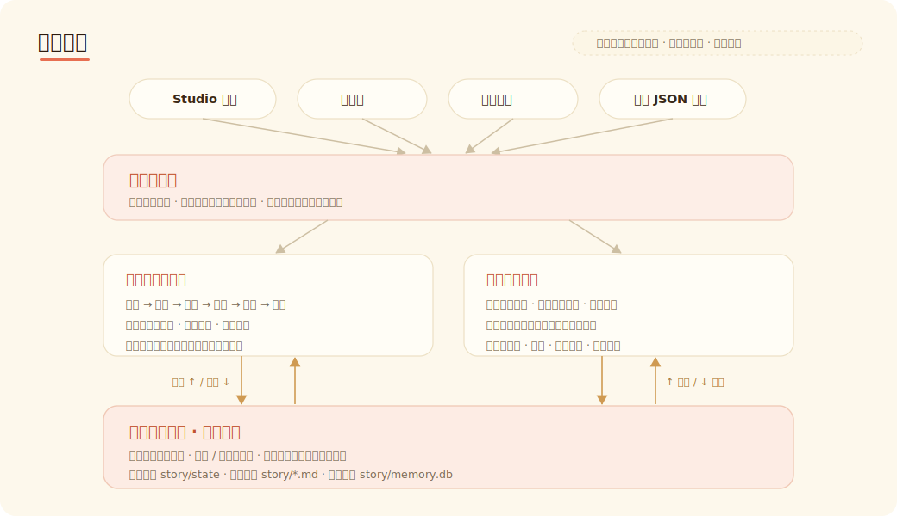
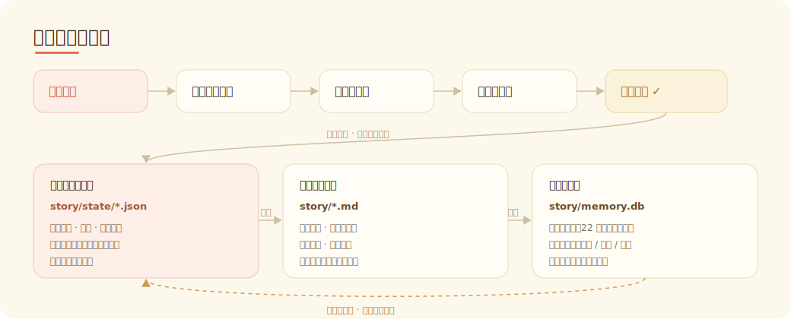
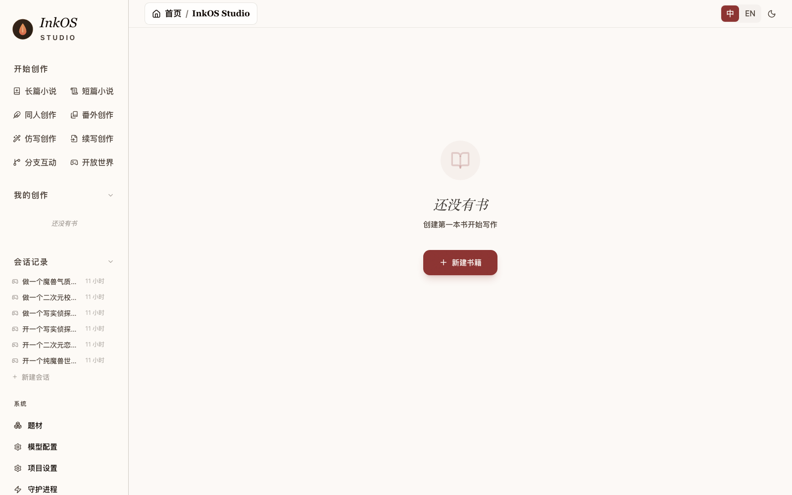

<p align="center">
  
  
</p>

<h1 align="center">Story Creation AI Agent<br><sub>AI agent system for long-form novel creation</sub></h1>

<p align="center">
  <a href="https://www.npmjs.com/package/@actalk/inkos"></a>
  <a href="LICENSE"></a>
  <a href="https://github.com/Narcooo/inkos/stargazers"></a>
  <a href="https://www.npmjs.com/package/@actalk/inkos"></a>
</p>

<p align="center">
  <picture>
    <source media="(prefers-color-scheme: dark)" srcset="https://kimi-file.moonshot.cn/prod-chat-kimi/kfs/4/1/2026-06-05/1d8h69mt3v89kkekg24gg">
    
  </picture>
</p>

<p align="center">
  <a href="README.md">中文</a> | English
</p>

---

InkOS is an AI agent system for long-form novel creation: from creative brief and foundation building to volume planning, chapter writing, auditing, and revision, with support for continuing existing works. It provides Studio, TUI, and CLI interfaces, putting ideas, settings, characters, memory, auditing, and revision under unified agent management so that long-form novels can be produced and revised continuously.

> 💡 **Give your writing agent a professional data layer first** — writing fiction isn't just about the model; what's usually missing is the source material. Pair InkOS with [**火花数据API (huohuaapi)**](https://huohuaapi.com/): a pay-per-call novel / web-fiction creation data API. Before the agent writes, it can pull sourced material — novel text, chapter structure, character profiles, writing style, and craft methods — instead of relying on prompts alone to fake a "plot outline".

## Current Focus: Long-Form Creation Workbench

InkOS now focuses on long-form novel creation. Studio Chat can help create books, import chapters, continue existing works, revise chapters, and edit project files. Heavy write operations use confirmation cards to avoid accidental changes.

- **Files and images in Chat**: text / Markdown attachments are injected into the LLM context; image attachments are sent as multimodal input to vision-capable models.
- **Chapter import**: existing manuscripts or chapter directories can be imported as real chapters, with foundation files and runtime state reverse-engineered for continued writing.
- **Interrupt long tasks**: Studio Chat can abort an in-flight agent turn when a model or provider stalls.
- **Safer chapter revision from Chat**: rewrite / revise requests now pass the current chat instruction as a one-off reviser brief; if a revision is kept out of disk, InkOS reports the revision gate metrics and remaining issues.

Current quality boundary: local chapter production, structured state, chapter/workflow recovery, and the complete deterministic suite have reached a stable usable baseline. The isolated Studio E2E suite is 10/10; its preparing and committed real child-process force-kill/restart recovery cases passed five combined rounds, 10/10 in total. `pnpm stress:process` passed with 8 workers, 400 contended mutations, and 30 force-kill recovery rounds; the release gate remains green. Known Studio, CLI, Chat, and sub-agent write bypasses, revise-mode validation, recovery preflights, and cross-process config writes are now converged. Exact current test counts and real-model limits are maintained only in the [current architecture and quality matrix](docs/current-architecture-and-priorities.md) so this README does not become stale after routine test changes.

**Long-form novels** — create from a brief, generate foundations, chapter intent, context packages, prose, review, revision, and state settlement. Context is governed with protected / compressible layers so long books remain steerable.

**Native English novel writing now supported！** — 10 built-in English genre profiles with dedicated pacing rules, fatigue word lists, and audit dimensions. Set `--lang en` and go.

## Quick Start

### Install

```bash
npm i -g @actalk/inkos
```

### Configure

InkOS now separates two configuration paths: **Studio uses visual service settings**, while **CLI / daemon / deployment can still use env overrides**. They do not silently overwrite each other.

**Option 1: Studio service settings (recommended for local writing)**

```bash
inkos init my-novel
cd my-novel
inkos
```

Open Studio, then go to **Model Settings**:

1. Choose a service such as Google Gemini, Moonshot, MiniMax, DeepSeek, kkaiapi, OpenRouter, or a custom endpoint.
2. Paste the API key and test the connection.
3. Pick an available model and save.
4. Return to Studio Chat or your book page.

Studio uses project service settings and `.inkos/secrets.json`. It may show env-detection hints, but env files do not override the Studio-selected service/model/base URL/API key.

MiniMax uses the official OpenAI-compatible `/v1/chat/completions` endpoint. InkOS disables returned thinking by default for `MiniMax-M3*`; M2.x thinking cannot be disabled by the upstream service.

**Option 2: CLI / daemon / deployment env config**

```bash
inkos config set-global \
  --lang en \
  --provider <openai|anthropic|custom> \
  --base-url <API endpoint> \
  --api-key <your API key> \
  --model <model name>

# provider: openai / anthropic / custom (use custom for OpenAI-compatible proxies)
# base-url: your API provider URL
# api-key: your API key
# model: your model name
```

`--lang en` sets English as the default writing language for CLI / daemon runs. Saved to `~/.inkos/.env`.

You can also edit global `~/.inkos/.env` or project `.env` manually:

```bash
# Required
INKOS_LLM_PROVIDER=                               # openai / anthropic / custom (use custom for any OpenAI-compatible API)
INKOS_LLM_BASE_URL=                               # API endpoint
INKOS_LLM_API_KEY=                                 # API Key
INKOS_LLM_MODEL=                                   # Model name

# Language (defaults to global setting or genre default)
# INKOS_DEFAULT_LANGUAGE=en                        # en or zh

# Optional
# INKOS_LLM_TEMPERATURE=0.7                       # Temperature
# INKOS_LLM_THINKING_BUDGET=0                      # Anthropic extended thinking budget
```

CLI resolution starts from Studio/project service settings, then layers service secrets, global env, project env, process env, and CLI flags. That means CLI can reuse the service you configured in Studio, while env and command-line flags remain explicit overrides.

**Option 3: Multi-model routing (optional)**

Assign different models to different agents — balance quality and cost:

```bash
# Assign different models/providers to different agents
inkos config set-model writer <model> --provider <provider> --base-url <url> --api-key-env <ENV_VAR>
inkos config set-model auditor <model> --provider <provider>
inkos config show-models        # View current routing
```

Agents without explicit overrides fall back to the global model.

**Configuration troubleshooting**

```bash
inkos doctor
```

`doctor` prints the current effective config mode, where the service / model / API key come from, and runs an API connectivity check. Common modes:

| Mode | Meaning |
|------|---------|
| `studio-project` | Studio runtime: only Studio/project settings and secrets are used |
| `cli-project` | CLI runtime: Studio settings as the base, with env and CLI flags layered on top |
| `legacy-env` | Legacy env mode: compatibility with old `.env`-only projects |

If a service test fails, first check that the service, model, and protocol match each other. Google Gemini AI Studio API keys work with the Gemini OpenAI-compatible endpoint; InkOS automatically disables the OpenAI `store` parameter that Google does not support. MiniMax defaults to the official OpenAI-compatible `/v1/chat/completions` endpoint and prefers a working non-streaming transport, avoiding streams that return usage but no text; `MiniMax-M3*` disables returned thinking by default, while M2.x thinking cannot be disabled upstream.

### LLM Configuration Notes

- **Studio / CLI config isolation**: Studio always uses the service page settings and `.inkos/secrets.json`; the CLI, daemon, and deployment environments support env overrides and one-off command flags.
- **Provider bank capability table**: built-in baseUrl, protocol, models, and compatibility policies for 15 services — Google Gemini, Moonshot, MiniMax, Zhipu (GLM), Bailian (Alibaba Cloud Model Studio), DeepSeek, SiliconFlow, Volcengine, Tencent Hunyuan, Baidu ERNIE (Wenxin), iFlytek Spark, OpenRouter, kkaiapi, Ollama, and CodingPlan.
- **Model ownership validation**: mismatches like `--service google --model kimi-k2.5` fail immediately, so requests are never sent to the wrong provider.
- **Google Gemini compatibility fix**: AI Studio API keys work directly with the Gemini OpenAI-compatible endpoint; InkOS automatically disables the OpenAI `store` parameter Google does not support.
- **MiniMax transport probing**: MiniMax / MiniMax CodingPlan use the official OpenAI-compatible `/v1` entry and automatically pick a working non-streaming transport, working around streams that report usage but return an empty body.
- **Legacy env compatibility**: the old `INKOS_LLM_BASE_URL + INKOS_LLM_MODEL + INKOS_LLM_API_KEY` combination still works for the CLI; without `INKOS_LLM_SERVICE`, InkOS tries to infer the service from the baseUrl.

### Current Interaction Entry Points

**Studio Chat + CLI + TUI share the same execution surface**

- **Studio Chat**: discuss, create books, and edit persistent files from one chat surface; heavy actions show confirmation cards.
- **Creation entries**: Long-form Novel and Continuation are available as first-class Studio entries.
- **TUI dashboard**: `inkos tui` opens the terminal full-screen interaction mode for keyboard-first users.
- **External agent entry**: `inkos interact --json --message "..."` is the structured entry for external agents and scripts.
- **Atomic commands remain**: `plan` / `compose` / `draft` / `audit` / `revise` / `write next` still work for scripting and advanced usage.

### Write Your First Book

English is the default for English genre profiles. Pick a genre and go:

```bash
inkos book create --title "The Last Delver" --genre litrpg     # LitRPG novel (English by default)
inkos write next my-book          # Write next chapter (full pipeline: draft → audit → revise)
inkos status                      # Check status
inkos review list my-book         # Review drafts
inkos review approve-all my-book  # Batch approve
inkos export my-book --format epub  # Export EPUB (read on phone/Kindle)
```

Language is set per-genre by default. Override explicitly with `--lang en` or `--lang zh`. Use `inkos genre list` to see all available genres and their default languages.

## English Genre Profiles

InkOS ships with 10 English-native genre profiles. Each includes genre-specific rules, pacing, fatigue word detection, and audit dimensions:

| Genre | Key Mechanics |
|-------|--------------|
| **LitRPG** | Numerical system, power scaling, stat progression |
| **Progression Fantasy** | Power scaling, no numerical system required |
| **Isekai** | Era research, world contrast, cultural fish-out-of-water |
| **Cultivation** | Power scaling, realm progression |
| **System Apocalypse** | Numerical system, survival mechanics |
| **Dungeon Core** | Numerical system, power scaling, territory management |
| **Romantasy** | Emotional arcs, dual POV pacing |
| **Sci-Fi** | Era research, tech consistency |
| **Tower Climber** | Numerical system, floor progression |
| **Cozy Fantasy** | Low-stakes pacing, comfort-first tone |

Also supports 5 Chinese web novel genres (xuanhuan, xianxia, urban, horror, other) for bilingual creators.

Every genre includes a **fatigue word list** (e.g., "delve", "tapestry", "testament", "intricate", "pivotal" for LitRPG) — the auditor flags these automatically so your prose doesn't read like every other AI-generated novel.

---

## Key Features

### 37-Dimension Audit + De-AI-ification

The Continuity Auditor agent checks every draft across 37 dimensions: character memory, resource continuity, hook payoff, outline adherence, narrative pacing, emotional arcs, and more. Built-in AI-tell detection automatically catches "LLM voice" — overused words, monotonous sentence patterns, excessive summarization. The default long-form write cycle now runs at most one automatic revision pass; unresolved critical findings are kept in the result for human review or later commands.

De-AI-ification rules are baked into the Writer agent's prompts: fatigue word lists, banned patterns, style fingerprint injection — reducing AI traces at the source. `revise --mode anti-detect` runs dedicated anti-detection rewriting on existing chapters.

### Creative Brief

`inkos book create --brief my-ideas.md` — pass your brainstorming notes, worldbuilding doc, or character sheets. The Architect agent builds from your brief (generating `story_bible.md` and `book_rules.md`) instead of inventing from scratch, and persists the brief into `story/author_intent.md` so the book's long-horizon intent does not disappear after initialization.

### Input Governance Control Surface

Every book now has two long-lived Markdown control docs:

- `story/author_intent.md`: what this book should become over the long horizon
- `story/current_focus.md`: what the next 1-3 chapters should pull attention back toward

Before writing, you can run:

```bash
inkos plan chapter my-book --context "Pull attention back to the mentor conflict first"
inkos compose chapter my-book
```

This generates `story/runtime/chapter-XXXX.intent.md`, `context.json`, `rule-stack.yaml`, and `trace.json`. `intent.md` is the human-readable contract; the others are execution/debug artifacts. `plan` calls the LLM to produce the chapter intent; `compose` only compiles local documents and state, so it can run before you finish API key setup.

### Length Governance

`draft`, `write next`, and `revise` now share the same conservative length governor:

- `--words` sets a target band, not an exact hard promise
- Chinese chapters default to `zh_chars`; English chapters default to `en_words`
- If the chapter drifts outside the soft band, InkOS may run one corrective normalization pass (compress or expand) instead of hard-cutting prose
- If the chapter still misses the hard range after that one pass, InkOS still saves it, but surfaces a visible length warning and telemetry in the result and chapter index

### Continuation Writing

`inkos import chapters` imports existing novel text and rebuilds structured state, chapter summaries, hooks, character relationships, and readable Markdown projections. It supports `Chapter N`, custom split patterns, and resumable import. After import, `inkos write next` can continue the story.

### Multi-Model Routing

Different agents can use different models and providers. Writer on Claude (stronger creative), Auditor on GPT-4o (cheaper and fast). `inkos config set-model` configures per-agent; unconfigured agents fall back to the global model.

### Daemon Mode + Notifications

`inkos up` starts an autonomous background loop that writes chapters on a schedule. The pipeline continues through handleable non-critical issues, pausing with reviewable results when human judgment is needed. Notifications via Telegram, Feishu (Lark), WeCom (Enterprise WeChat), and Webhook (HMAC-SHA256 signing + event filtering). Logs to `inkos.log` (JSON Lines), `-q` for quiet mode.

### Local Model Compatibility

Supports any OpenAI-compatible endpoint (`--provider custom`). Stream auto-fallback — when SSE isn't supported, InkOS retries with sync mode automatically. Fallback parser handles non-standard output from smaller models, and partial content recovery kicks in on stream interruption.

### Reliability

Every chapter creates an automatic state snapshot — `inkos write rewrite` rolls back any chapter to its pre-write state. The Writer outputs a pre-write checklist (context scope, resources, pending hooks, risks) and a post-write settlement table; the Auditor cross-validates both. Book and project-config mutations are serialized by cross-process file locks. Chapter artifacts and plan/compose/audit/consolidate outputs use transaction markers, backups, atomic replacement, and failure recovery so prose, indexes, truth, runtime, and summaries cannot be left partially committed. Post-write validation includes cross-chapter repetition detection and a dozen hard rules with auto spot-fix.

Studio listens on `127.0.0.1` by default and does not enable wildcard CORS. Service APIs expose only whether a secret is configured, never the raw API key. LAN access requires an explicit `INKOS_STUDIO_HOST` and an authentication boundary appropriate for the deployment environment.

The hook system uses Zod schema validation — `lastAdvancedChapter` must be an integer, `status` can only be open/progressing/deferred/resolved. JSON deltas from the LLM are processed through `applyRuntimeStateDelta` (immutable update) and `validateRuntimeState` (structural check) before persistence. Corrupted data is rejected, not propagated.

Model output limits are managed by provider model cards in the provider bank. Reserved keys in `llm.extra` (max_tokens, temperature, model, messages, stream, etc.) are stripped to prevent accidental overrides of core request parameters.

---

## How It Works

InkOS's long-form production track generates deliverable text, with agents sharing model configuration, Studio Chat, action confirmation, and artifact preview.

<p align="center">
  
</p>

Long-form chapters are produced by multiple agents in sequence:

<p align="center">
  
</p>

| Agent | Responsibility |
|-------|---------------|
| **Planner** | Reads author intent + current focus + memory retrieval results, produces chapter intent (must-keep / must-avoid) |
| **Composer** | Selects task-relevant context from structured state, control docs, and Markdown projections, then compiles rule stack and runtime artifacts |
| **Architect** | Generates foundation files during book creation or import: story frame, rules, characters, and long-horizon control files |
| **Writer** | Produces prose from the composed context (length-governed, dialogue-driven) |
| **Observer** | Over-extracts 9 categories of facts from the chapter text (characters, locations, resources, relationships, emotions, information, hooks, time, physical state) |
| **Reflector** | Outputs a JSON delta (not full markdown); code-layer applies Zod schema validation then immutable write |
| **Normalizer** | Single-pass compress/expand only when the chapter clearly leaves the hard length range |
| **Continuity Auditor** | Validates the draft against structured state, control docs, and chapter context |
| **Reviser** | Fixes critical issues found by the auditor; the default write cycle runs at most one automatic revision pass and flags the rest for human review |

If the audit fails, the default pipeline runs one revise → re-audit pass. Remaining issues are preserved in the result and state for human review or later commands.

### Long-Term Memory

Each book's canonical memory is split into three layers:

| Layer | Purpose |
|-------|---------|
| `story/state/*.json` | Authoritative structured state: current state, hooks, chapter summaries, and related runtime data, validated with Zod schemas |
| `story/*.md` | Human-readable projections such as `current_state.md`, `pending_hooks.md`, `chapter_summaries.md`, and `character_matrix.md` |
| `story/memory.db` | SQLite temporal memory on Node 22+, used for relevance-based retrieval of facts, hooks, and summaries |

The Continuity Auditor checks drafts against this state. If a character "remembers" something they never witnessed, or pulls a weapon they lost two chapters ago, the auditor catches it.

The Settler no longer asks the model to output full markdown files. It produces a JSON delta, and the code layer applies and validates it immutably before persistence. Markdown remains as a readable projection. Existing books migrate from legacy Markdown on first run.

On Node 22+, a SQLite temporal memory database (`story/memory.db`) is automatically enabled, supporting relevance-based retrieval of historical facts, hooks, and chapter summaries — preventing context bloat from full-file injection.

<p align="center">
  
</p>

### Control Surface and Runtime Artifacts

Alongside runtime state, InkOS splits guardrails from customization into reviewable control docs:

- `story/author_intent.md`: long-horizon author intent
- `story/current_focus.md`: near-term steering
- `story/runtime/chapter-XXXX.intent.md`: chapter goal, keep/avoid list, conflict resolution
- `story/runtime/chapter-XXXX.context.json`: the actual context selected for this chapter
- `story/runtime/chapter-XXXX.rule-stack.yaml`: priority layers and override relationships
- `story/runtime/chapter-XXXX.trace.json`: compilation trace for this chapter

That means briefs, outline nodes, book rules, and current requests are no longer mashed into one prompt blob; InkOS compiles them first, then writes.

### Writing Rule System

The Writer agent has ~25 universal writing rules (character craft, narrative technique, logical consistency, language constraints, de-AI-ification), applicable to all genres.

On top of that, each genre has dedicated rules (prohibitions, language constraints, pacing, audit dimensions), and each book has its own `book_rules.md` (protagonist personality, numerical caps, custom prohibitions), `story_bible.md` (worldbuilding), `author_intent.md` (long-horizon direction), and `current_focus.md` (near-term steering). `volume_outline.md` still acts as the default plan, but in v2 input governance it no longer automatically overrides the current chapter intent.

## Usage Modes

InkOS provides three interaction modes. The main Studio/CLI writing paths share the same core operations; remaining bypasses are tracked in the architecture review:

### 1. Full Pipeline (One Command)

```bash
inkos write next my-book              # Draft → audit → auto-revise, all in one
inkos write next my-book --count 5    # Write 5 chapters in sequence
```

`write next` now uses the `plan -> compose -> write` governance chain by default. If you need the older prompt-assembly path, set this explicitly in `inkos.json`:

```json
{
  "inputGovernanceMode": "legacy"
}
```

The default is now `v2`. `legacy` remains available as an explicit fallback.

### 2. Atomic Commands (Composable, External Agent Friendly)

```bash
inkos plan chapter my-book --context "Focus on the mentor conflict first" --json
inkos compose chapter my-book --json
inkos draft my-book --context "Focus on the dungeon boss encounter and party dynamics" --json
inkos audit my-book 31 --json
inkos revise my-book 31 --json
```

Each command performs a single operation independently. `--json` outputs structured data. `plan` / `compose` govern inputs; `draft` / `audit` / `revise` handle prose and quality checks. They can be called by external AI agents via `exec`, or used in scripts.

### 3. Natural Language Agent Mode

```bash
inkos agent "Write a LitRPG novel where the MC is a healer class in a dungeon world"
inkos agent "Write the next chapter, focus on the boss fight and loot distribution"
```

Agent mode exposes tools according to the current session kind: book creation, control-surface edits, planning, composition, writing, audit, and revision tools are only made available where they make sense. The recommended agent flow is: adjust the control surface first, then `plan` / `compose`, then choose draft-only or full-pipeline writing.

## Studio Screenshot

<p align="center">
  
</p>

Local Studio screenshot.

## CLI Reference

| Command | Description |
|---------|-------------|
| `inkos init [name]` | Initialize project (omit name to init current directory) |
| `inkos book create` | Create a new book (`--genre`, `--chapter-words`, `--target-chapters`, `--brief <file>`, `--lang en/zh`) |
| `inkos book update [id]` | Update book settings (`--chapter-words`, `--target-chapters`, `--status`, `--lang`) |
| `inkos book list` | List all books |
| `inkos book delete <id>` | Delete a book and all its data (`--force` to skip confirmation) |
| `inkos genre list/show/copy/create` | View, copy, or create genres |
| `inkos plan chapter [id]` | Generate the next chapter's `intent.md` (`--context` / `--context-file` for current steering) |
| `inkos compose chapter [id]` | Generate the next chapter's `context.json`, `rule-stack.yaml`, and `trace.json` |
| `inkos write next [id]` | Full pipeline: write next chapter (`--words` to override, `--count` for batch, `-q` quiet mode) |
| `inkos write rewrite [id] <n>` | Rewrite chapter N (restores state snapshot, `--force` to skip confirmation) |
| `inkos draft [id]` | Write draft only (`--words` to override word count, `-q` quiet mode) |
| `inkos audit [id] [n]` | Audit a specific chapter |
| `inkos revise [id] [n]` | Revise a specific chapter |
| `inkos agent <instruction>` | Natural language agent mode |
| `inkos review list [id]` | Review drafts |
| `inkos review approve-all [id]` | Batch approve |
| `inkos status [id]` | Project status |
| `inkos export [id]` | Export book (`--format txt/md/epub`, `--output <path>`, `--approved-only`) |
| `inkos eval [id]` | Generate a quality evaluation report (`--json`, chapter ranges) |
| `inkos consolidate [id]` | Consolidate chapter summaries for long-book context control |
| `inkos interact` | External-agent / CLI natural-language entry (`--json`, `--message`, `--book`) |
| `inkos config set-global` | Set the global CLI / daemon / deployment LLM env config (`~/.inkos/.env`) |
| `inkos config show-global` | Show the global config |
| `inkos config set/show` | View or update project configuration |
| `inkos config set-model <agent> <model>` | Per-agent model override (`--base-url`, `--provider`, `--api-key-env`) |
| `inkos config remove-model <agent>` | Remove a per-agent model override (fall back to the default) |
| `inkos config show-models` | Show current model routing |
| `inkos doctor` | Diagnose setup issues (API connectivity test + provider compatibility hints) |
| `inkos detect [id] [n]` | AIGC detection (`--all` for all chapters, `--stats` for statistics) |
| `inkos import canon [id] --from <parent>` | Import parent canon into a spinoff book |
| `inkos import chapters [id] --from <path>` | Import existing chapters for continuation (`--split`, `--resume-from`) |
| `inkos analytics [id]` / `inkos stats [id]` | Book analytics; `--chapters 4-6 --llm-report` builds an operation-correlated multi-chapter LLM cost/gate report, and `--save-report` writes it under `.inkos/reports` |
| `inkos update` | Update to the latest version |
| `inkos` / `inkos studio` | Start web workbench (`-p` for port, default 4567) |
| `inkos tui` | Start terminal full-screen TUI |
| `inkos up / down` | Start/stop daemon (`-q` quiet mode, auto-writes `inkos.log`) |

`[id]` is auto-detected when the project has only one book. All commands support `--json` for structured output. `draft` / `write next` / `plan chapter` / `compose chapter` accept `--context` for steering, and `--words` overrides the target chapter size. `book create` supports `--brief <file>` to pass a creative brief — the Architect builds from your ideas instead of generating from scratch. `plan chapter` calls the LLM to create chapter intent; `compose chapter` does not require a live LLM, so you can inspect governed inputs before finishing API setup.

Example live-cost review: `inkos analytics --chapters 4-6 --llm-report --save-report --max-total-tokens 600000 --max-chapter-tokens 200000 --max-prompt-tokens 16000 --max-retry-rate 0.2 --max-audit-calls 2 --max-revision-calls 1 --max-normalize-calls 2 --max-settle-calls 1`. The report treats persisted operation telemetry as authoritative, shows the gap against chapter-index token totals, includes per-chapter governance call counts and automatic-review termination reasons, and surfaces legacy recovery calls without an operation ID instead of silently dropping their cost.

The CLI also accepts one-off LLM override flags at runtime: `--service`, `--model`, `--api-key-env`, `--base-url`, `--api-format <chat|responses>`, `--stream`, `--no-stream`. For example:

```bash
inkos write next --service google --model gemini-2.5-flash
inkos up --service moonshot --model kimi-k2.5 --api-key-env MOONSHOT_API_KEY
```

## Development and Design Docs

- [Development documentation index](docs/README.md)
- [Current architecture and development priorities](docs/current-architecture-and-priorities.md)
- [Canon governance and volume closure design](docs/canon-governance-volume-closure-design.md)
- [Live LLM testing and stage records](docs/live-llm-testing-and-next-goals.md)

## Roadmap

The authoritative order is maintained in [Current Architecture and Development Priorities](docs/current-architecture-and-priorities.md):

- **P0 (complete)**: unified core mutations, chapter/workflow recovery, cross-process config locking, force-kill E2E, and process contention stress coverage.
- **P1 (current)**: establish multi-chapter quality reports and token/context budgets; split the Studio server and PipelineRunner by domain; further lazy-load Mermaid, Shiki, and WASM-heavy features.
- **P2**: partial chapter rewrites, a custom agent/plugin contract, and platform-specific exports.

Microservices and a remote database are not current goals. The local-first filesystem, structured truth, and SQLite memory remain the default architecture.

## Contributing

Contributions welcome. Open an issue or PR.

Development is moving quickly. More features and writing-quality improvements will keep landing. Feedback, feature requests, and project follow-up are all welcome. The goal is to build the strongest AI novel-writing Agent.

```bash
pnpm install
pnpm dev          # Watch mode for all packages
pnpm test         # Run tests
pnpm typecheck    # Type-check without emitting
```

## Star History

<a href="https://www.star-history.com/#Narcooo/inkos&type=date&legend=top-left">
 <picture>
   <source media="(prefers-color-scheme: dark)" srcset="https://api.star-history.com/svg?repos=Narcooo/inkos&type=date&theme=dark&legend=top-left" />
   <source media="(prefers-color-scheme: light)" srcset="https://api.star-history.com/svg?repos=Narcooo/inkos&type=date&legend=top-left" />
   
 </picture>
</a>

## Repobeats


## Contributors

<a href="https://github.com/Narcooo/inkos/graphs/contributors">
  
</a>

## Acknowledgments

InkOS's agent runtime is built on [pi](https://github.com/badlogic/pi-mono) (`@mariozechner/pi-ai` and `@mariozechner/pi-agent-core`) by Mario Zechner. Thanks to pi for the solid foundation.

## License

[AGPL-3.0](LICENSE)
