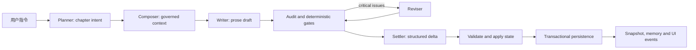

# InkOS 当前架构与开发优先级

状态：当前开发基线  
复核日期：2026-07-16

## 1. 复核结论

InkOS 已经不是原型式的单次文本生成器，而是一个本地优先的长篇小说生产系统。当前主干具备：

- 从创作简报、基础设定、卷级规划到章节生产的完整工作流。
- 结构化 truth、Markdown 可读投影、SQLite 时序记忆和章节快照。
- Planner、Composer、Writer、Auditor、Reviser、Settler 等多 agent 分工与多模型路由。
- Studio、TUI、CLI 和外部 `interact` 入口。
- 章节持久化事务、项目和书籍级并发控制、失败恢复及状态校验。
- 调用级 LLM telemetry、Studio SSE 诊断和 provider 兼容处理。

当前最主要的工程风险已经从底层持久化和跨入口写入旁路，转移到真实模型长距离连续写作中的状态协议稳定性。2026-07-16 的 DeepSeek 官方 `deepseek-v4-flash` 真实前后端 20 章样本实际持久化了 15 章：第 1-15 章均为 `ready-for-review` 并通过 Doctor，章节索引、manifest、current state 和快照一致停在 15；运行期 LLM telemetry 为 310/310 success、0 retry、`3,848,794` tokens。第 16 章未提交，进程在中间态被外部终止，因此不能表述为“20 章通过”。该样本定位到第 15 章 resync analyzer 把标准伏笔 ID 写成 `H027 (标题)`，后续 Planner 使用规范 ID `H027` 时被 ledger 校验拒绝。当前代码已在 resync 校验和落盘前规范化 Markdown 第一列，并在结构化状态加载时修复、去重 canonical ID；Core 回归覆盖 Markdown、`hooks.json` 和冲突迁移。下一次真实验收应从全新隔离项目重跑 20 章，重点验证第 15→16 章、报告终态和 truth/Doctor 一致性。token 继续记录用于容量判断，但不再作为当前功能验收的阻断项。Playwright 隔离 E2E、跨进程竞争和强杀恢复基线仍保持全绿；确定性门禁通过不等于真实 20 章已经完成。

### 1.1 实际完成度与质量矩阵

状态定义：

- **已完成**：主路径已接线，有确定性回归，可作为当前功能基线。
- **可用/持续增强**：功能可运行，但真实场景证据、统一性或性能仍不足。
- **未完成**：只有局部实现、设计或路线图，没有可验收的完整用户路径。

| 能力域 | 开发状态 | 完成质量 | 实际证据与边界 |
| --- | --- | --- | --- |
| 建书、导入与基础设定 | 已完成 | 中高 | core、CLI、Studio 均有接线；stub authoring E2E 可完成建书，但真实 provider 建书没有稳定的发布级回归 |
| `plan -> compose -> write -> audit -> revise -> settle` | 已完成 | 高（确定性）/中高（真实模型） | Runner、共享审计合同、resync 兜底和状态门禁有完整回归；真实 20 章样本连续提交 15 章，仍缺伏笔 ID 修复后的完整 20 章复验 |
| 结构化 state、Canon、claim、volume、hook 治理 | 已完成/持续增强 | 高（结构）/中（语义） | schema、reducer、golden corpus 和门禁有回归；不能表述为完整语义证明 |
| 原子写入、章节/工作流事务、book/config lock | 已完成（本地基线） | 高 | 章节事务、workflow crash journal、跨进程书籍锁与项目配置锁均有回归；8 worker 竞争写入和 30 轮真实强杀/恢复通过 |
| rewrite、review、rollback | 已完成 | 高 | approve/reject/rewrite 共享 core mutation command；rewrite 由 PipelineRunner 持有唯一 book lock，CLI 不再手工组合回滚 |
| Studio、CLI、TUI、`interact` | 可用/持续增强 | 高（入口一致性）/中高（体验） | 高频 mutation、长操作和 sub-agent auditor 已共享 core command；revise mode 在 core/Studio/CLI 运行时校验，受控文件不能被 Chat 直接覆盖 |
| Studio telemetry 与错误诊断 | 可用/持续增强 | 中高 | SSE、Doctor、聊天和侧栏已有调用级信息与根因聚合；report v2 已支持 agent/phase、service/model 和 agent/service/model 交叉统计，尚缺修复后的真实 provider 失败样例覆盖 |
| 上下文与性能治理 | 可用/持续增强 | 中高 | 已有 Prompt Assembly Trace、per-source 统计、确定性去重、三层上下文、稳定上下文编译缓存和可配置 per-agent/per-phase 预算报告；仍缺真实多章账单、缓存命中率和质量基线 |
| 本地 API 与依赖安全 | 已完成（localhost 基线） | 高 | localhost、无 wildcard CORS、密钥遮蔽、路径校验、生产审计为 0；不覆盖公网部署认证 |
| 局部章节重写、插件、平台格式导出 | 未完成 | 低/无完整验收 | 仍属于产品路线图，不应计入当前版本完成度 |

因此，当前项目可以描述为“本地长篇生产主链路稳定可用，平台可靠性基线已完成，真实模型质量和架构收敛仍在进行”，不能描述为“所有入口、性能和长篇语义质量已经完成”。

### 1.2 2026-07-11 历史验收快照

本快照描述本地 Windows 工作区的可复验工程质量，不将 stub E2E、确定性测试或单次真实模型试运行误表述为生产模型质量保证。

| 验证层级 | 命令/证据 | 当前结果 | 覆盖边界 |
| --- | --- | --- | --- |
| Core 回归 | `pnpm --filter @actalk/inkos-core test` | 121 个测试文件、1253 项通过 | 状态、mutation command、章节/工作流事务恢复、配置锁、Pipeline、provider、治理门禁与路径安全 |
| Studio 回归 | `pnpm --filter @actalk/inkos-studio test` | 33 个测试文件、392 项通过 | Hono API、共享 mutation 接线、受控文件保护、SSE 状态、失败处置、Doctor、路由与前端状态 |
| Studio E2E | `pnpm --filter @actalk/inkos-studio test:e2e` | 完整套件 8/8；两种真实进程 recovery 连续 5 轮共 10/10 | 隔离根目录、动态端口、事务恢复、进程强杀/重启、committed cleanup、陈旧锁回收、锁冲突、服务探测与 shell/API smoke |
| CLI 回归 | `pnpm --filter @actalk/inkos test` | 36 个测试文件、207 项通过 | 命令、TUI、运行时解析、发布打包与集成路径 |
| 进程压力 | `pnpm stress:process` | 通过 | 8 worker；book/config 各 200 次竞争 mutation；workflow 20 轮、chapter 10 轮 preparing/committed 强杀恢复 |
| 发布链 | `pnpm release` | 通过 | typecheck、semantic audit、build、bundle、1852 项 Vitest、publish manifest、生产审计与 8 项隔离 E2E 全绿 |

质量结论：确定性主链路、跨入口 mutation、章节/工作流崩溃恢复和跨进程竞争已形成全绿本地发布基线。当前仍不能由离线测试证明真实 LLM 的输出质量、上游可用性和成本；Studio 构建仍会报告部分 chunk 超过 500 KiB。

### 1.3 2026-07-12 真实 Studio 三章复测快照

本轮使用 Studio 真实前端按钮、已配置 OpenRouter 服务和 `deepseek/deepseek-v4-pro`，复用测试书完成第 3 章写作、审计、状态修复和恢复验证。测试数据位于 Git 忽略目录，不进入产品提交。

| 检查项 | 结果 | 结论 |
| --- | --- | --- |
| 模型路由 | Planner、Writer、Normalizer、Auditor、Reviser、Analyzer、State Validator 均为 `openrouter / deepseek/deepseek-v4-pro` | 未回退到 `openrouter/auto` |
| Planner | 长 hook ID 首次被模型删去连字符，第二次按合法 ID 重试后通过；未进入 fallback | 重试可恢复，但 ID 协议仍脆弱 |
| 长度治理 | Writer 约 5115 字，归一化约 3355 字，修订后 3014 字 | 二次长度收敛有效，落入软目标区间 |
| 审计与状态 | 首轮因 gate 误报进入 `audit-failed`；独立审计后为 `state-degraded`；修复状态后恢复 `ready-for-review` | 保护和回滚有效，但不同入口审计合同不一致 |
| truth 完整性 | `manifest/currentState/snapshot = 3`，摘要 3 条，H001-H012 完整 | 状态最终可恢复 |
| hook 治理 | 结算一度因“信息”与 `information` 类型漂移创建两条重复 hook，清理后为 14 条 | 需要统一 hook 类型和稳定 ID |
| 确定性回归 | Core 121 个测试文件、1291 项通过；Core typecheck/build 通过 | 离线回归未能提前覆盖上述真实输出漂移 |

本轮证明了现有事务保护能阻止错误状态继续传播，也证明了“测试全绿”不能替代真实前端、真实模型和中断恢复组合测试。

## 2. 系统边界

| 包 | 当前职责 | 边界要求 |
| --- | --- | --- |
| `packages/core` | agent、Pipeline、状态模型、持久化、记忆、LLM/provider、领域校验 | 所有书籍和章节业务规则应在此闭环 |
| `packages/cli` | CLI/TUI/daemon、参数解析、结构化输出 | 只组装命令和展示结果，不复制 Pipeline 规则 |
| `packages/studio` | React 工作台、Hono API、会话与诊断界面 | API 路由应调用 core 用例，不直接编排多步领域写入 |

当前包划分合理，不需要拆成微服务，也不需要为了扩展性把本地文件模型整体迁移到远程数据库。

## 3. 当前章节工作流

默认流程是 `plan -> compose -> write -> audit -> optional revise -> settle -> persist`。其中：

- 文笔模型负责正文渲染，不拥有设定和状态裁决权。
- Canon、claim、volume、hook 和 state validator 负责高风险约束。
- 结构化状态是权威真源，Markdown 是人类可读投影。
- 审计失败默认只自动修订有限次数，剩余问题交给人工审核。
- rewrite 必须由一个 core 用例在同一把 book lock 下完成回滚和再生成。

## 4. 数据、事务与并发模型

### 4.1 数据层级

| 层 | 作用 |
| --- | --- |
| `book.json`、`chapters/index.json` | 书籍配置和章节索引 |
| `story/state/*.json` | 权威结构化运行状态 |
| `story/*.md` | 可读 truth 投影和控制文档 |
| `story/runtime/*` | 每章 intent、context、rule stack、trace 和治理诊断 |
| `story/snapshots/*` | rewrite 和失败恢复使用的章节前状态 |
| `story/memory.db` | 相关事实、伏笔和摘要的时序检索 |

### 4.2 写入语义

- 章节索引、book config、结构化状态、secrets 与 Studio 项目设置通过临时文件加 rename 原子替换。
- 章节落盘使用 `.chapter-persistence.json` 事务标记记录 preparing/commit 状态。
- 事务开始前保留可恢复快照；失败时回滚，启动新写作前先恢复未完成事务。
- 同一本书的变更由 `.write.lock` 串行化。
- Studio、CLI 和配置迁移统一使用 `.inkos-project-config.lock`、原子替换和死进程陈旧锁回收，避免跨进程更新丢字段。
- transcript 追加使用内存中的序列和事件缓存，不再为每条消息重读完整 JSONL；缓存按 TTL 回收。

当前操作合同并不完全等价：

| 操作 | 锁所有权 | recovery / 事务边界 |
| --- | --- | --- |
| draft、write next、rewrite | `PipelineRunner` | 先恢复遗留章节事务；章节正文、索引和 truth 受 chapter persistence marker 保护 |
| plan、compose、audit、consolidate | core mutation command | 先恢复章节事务；再用 `.core-workflow-mutation.json` 和备份目录保护 runtime、audit 与 summary 多文件输出 |
| revise、repair-state、resync、import | `PipelineRunner` | 在同一把 book lock 内统一执行章节事务 recovery preflight |
| chapter save/patch、truth edit、book config/review mode、delete | core mutation command | 单一 book lock；delete 对不存在书籍统一返回 typed `BOOK_NOT_FOUND` |
| Studio/CLI/config migration | project config mutation | `.inkos-project-config.lock` 跨进程串行化、原子替换、死 PID 陈旧锁回收 |

### 4.3 当前限制

- book lock 会覆盖较长的 LLM 操作，保证正确性但限制同一本书的并行吞吐。
- 文件系统事务不是数据库事务；当前压力证据覆盖本地多进程竞争与强杀恢复，不覆盖网络文件系统、分布式租约或高并发服务端部署。
- 结构化 truth 与 Markdown 投影仍有双写成本，必须坚持“JSON 权威、Markdown 可重建”。
- workflow crash journal 采用备份、preparing/committed marker 与恢复清理；新增目标目录时必须同步扩展备份清单和故障注入。

## 5. API 与本地安全边界

- Studio 默认只监听 `127.0.0.1`；只有显式设置 `INKOS_STUDIO_HOST` 才扩大监听范围。
- API 不启用 wildcard CORS。
- Studio 只返回密钥是否已配置，不返回原始 API Key；空密钥更新默认保留现有值，显式 clear 才删除。
- core mutation command、agent session bookId、sessionId、revise mode 和主要章节路由均执行运行时校验；Studio Chat 对权威文件和运行时内部目录采用拒绝式 allowlist。
- destructive session 路由不能通过 traversal-shaped ID 访问 `.inkos` 或其他项目文件。
- 生产依赖通过 workspace overrides 固定到已修复版本；2026-07-11 的 `pnpm audit --prod` 为 0。

当前不需要为本地个人项目引入账号、RBAC 或远程鉴权。若默认部署目标改为局域网或公网，认证、CSRF、来源策略和速率限制必须先于远程开放完成。

## 6. 性能判断

### 6.1 主要成本

性能瓶颈按影响排序：

1. LLM 调用耗时、重试和上下文 token 体积。
2. 多 agent 串行链路和同书长时间持锁。
3. Studio 的 Mermaid、Shiki、WASM 和图形依赖体积。
4. CLI 集成测试反复启动子进程的时间。
5. 文件 JSON/Markdown 解析与原子写入。

文件系统目前不是首要性能瓶颈。除 transcript 这类高频追加路径外，不应优先做低收益微优化。

### 6.2 当前性能基线

- Studio 构建约转换 5200 个模块，入口 JS/CSS 仍在仓库 bundle 预算内。
- 页面路由已经使用 React lazy loading；Mermaid、代码高亮、数学和部分 Streamdown 插件仍在消息/摘要组件静态导入，部分 grammar 和 WASM chunk 超过 Vite 默认 500 KiB 警告线。
- 2026-07-16 完整回归为 Core 131 个测试文件、1452 项通过，Studio 34 个测试文件、405 项通过，CLI 36 个测试文件、210 项通过；当前确定性测试共 2067 项。CLI 集成测试反复启动子进程，仍是主要耗时来源。
- `scripts/live-dual-api-routing.mjs` 与 linked acceptance report 会记录 agent/phase、service/model、token、重试、fallback、repair/resync 和治理调用。最新 20 章样本的运行时 JSONL 共 310 次调用、`3,848,794` tokens、0 retry，最大估算 prompt `23,402`；报告进程被外部终止后顶层汇总仍为中间态，后续需要让报告终态与持久化章节状态独立于父进程退出而可靠收口。
- Composer 已执行 token budget 和 verbatim/semantic/compressible 三层上下文策略；Provider telemetry 与 ChapterTrace 已记录 per-source 字符数、估算 token、tier、fingerprint、selected/compressed 状态和重复 fingerprint 组。PipelineRunner 按项目/书籍、模型、语言、预算和稳定 source 指纹持久化缓存稳定上下文编译结果，动态章节上下文不会进入缓存；真实 15 章证明缓存路径可持续运行，但当前优先级是状态协议和完整 20 章终态，不是继续压低写作成本。

## 7. 设计问题与技术债

### 7.1 多入口业务编排

Studio、CLI、Chat 和直接 API 历史上存在各自组合 rollback、write、approve、truth edit 的路径。当前已知写操作均已收敛到 core command 或 project config mutation：sub-agent auditor 使用 `audit-chapter`，Studio Chat 拒绝直接覆盖权威文件，revise mode 在运行时解析。后续新增 mutation 时应把“校验、锁、恢复、事务、事件、错误合同”作为一个完整用例提交，入口层只负责参数与展示。

### 7.2 大型模块

- `packages/studio/src/api/server.ts` 约 4930 行，同时承担路由、配置、密钥、会话、provider 探测和业务调度。
- `packages/core/src/pipeline/runner.ts` 约 4400 行，同时承担多个工作流、恢复、持久化和事件编排。

拆分时应按业务域拆分，不按“utils/helpers”堆放：books、chapters、sessions、services、project settings，以及 foundation、chapter、rewrite、persistence workflow。

### 7.3 依赖接口过宽

测试 mock 经常需要模拟完整 `StateManager`。后续应引入更小的能力接口，例如 `BookLock`、`BookRepository`、`ChapterRepository`、`RuntimeStateStore`，但只在实际拆分工作流时引入，避免先造抽象后找用途。

### 7.4 上游依赖生命周期

`@mariozechner/pi-ai` 与 `@mariozechner/pi-agent-core` 已被上游标记 deprecated。短期继续固定版本，所有 provider-specific 类型必须限制在 LLM adapter 层，并为后续替换保留合同测试。

### 7.5 已关闭：审计合同不一致

完整写作和独立审计现在共享章节评估合同，并恢复同一组正文、memo、compiled claims、hook ledger、volume contract 和 truth overrides。后续风险不再是入口逻辑分叉，而是新增 gate 时必须继续接入共享用例并明确记录来源。

### 7.6 已关闭：状态修复依赖 Settler 完整回写

resync 已按 Settler 初次结算、带校验反馈重试、Chapter Analyzer 重建的顺序执行；任何阶段无法提供完整 state、hooks 和 summary 时恢复原快照并返回单一可执行错误。Analyzer 输出的标准伏笔 ID 会在校验和落盘前规范化，避免显示标题成为 ID 的一部分。下一阶段只需继续扩大真实响应 corpus，不再新增另一套状态修复路径。

### 7.7 已关闭并补强：Hook 身份和跨语言类型漂移

新派生 hook 使用 `Dnnn` 短稳定 ID，中文/英文 type 与 status 在输入边界规范化，旧长 ID 通过确定性别名兼容。20 章样本进一步暴露了 `H027 (标题)` 这类“编号 + 展示名”漂移；当前只对 `H/D/L + 数字` 标准 ID 剥离半角或全角括号标题，语义型 ID 保持原样。Markdown 仅改第一列，结构化 JSON 加载会迁移 canonical ID；冲突时保留最后一条完整记录并写入 migration warning，不做字段级猜测合并。剩余工作是用新的 20 章 corpus 验证长期重复家族率，而不是再次改变主键协议。

### 7.8 Gate 必须以局部高置信度证据阻断

本轮 claim gate 曾把“无需维护”“无需人工复核”与全文中的世界规则关键词拼接，产生 critical 误报。硬 gate 不应通过全文词袋做跨段推断；阻断条件必须限定在同一语句/事件窗口，并要求规则主体、绕过动作和缺失成本同时出现。低置信度判断降为 warning 或交给 Auditor。

### 7.9 真实模型 E2E 覆盖不足

现有隔离 Studio E2E 已覆盖事务、stub authoring、取消、不落章、重试和 `state-degraded -> repair-state -> ready-for-review`，确定性测试覆盖长 ID、审计入口一致性、resync 失败回滚和 hook 去重。真实 linked acceptance 已取得 15 个连续持久化章节的证据，但缺少 ID 修复后的完整 20 章终态和可重复的脱敏响应 corpus；联网测试不进入每次提交门禁。

### 7.10 真实长跑资源画像（非当前阻断）

最新 DeepSeek 20 章样本从建书到第 16 章中间态共记录 310 次成功调用和 `3,848,794` tokens，最大估算 prompt `23,402`，0 retry。该数据用于容量规划和定位 agent 热点，不再作为当前功能验收的硬门槛；当前验收只阻断协议错误、truth 不一致、未恢复状态、章节未提交和报告终态缺失。默认预算仍应保留为可配置保护，但不通过提高或降低阈值掩盖状态问题。

## 8. 当前开发优先级

优先级定义：P0 是下一个稳定版本必须完成；P1 是随后一个工程迭代；P2 是产品扩展，不应抢占可靠性工作。

### P0：真实写作合同一致性（已完成）

#### P0.1 统一完整写作与独立审计（Core 合同已完成）

- 抽取共享 `evaluateChapter` 用例，由 write/review/re-audit 共用。
- 输入统一包含正文、持久化 memo、compiled claims、hook ledger、volume contract、truth overrides 和语言配置。
- 同一正文和同一 truth 快照在不同入口必须产生相同 blocking issue 集合。
- 审计结果记录 gate 来源，Studio 能区分 continuity、claim、hook、volume 和 state 问题。

完成定义：为“完整写作失败、独立审计错误通过”增加回归；Studio、CLI、Chat 和 core 直接调用返回一致状态。

2026-07-12 进展：`runChapterReviewCycle` 与 `auditDraft` 已统一调用同一个章节评估合同；独立审计会恢复历史 plan/memo、context package、rule stack、compiled claims、hook ledger 和 volume contract，并继续保留 `state-sync-required` 状态保护。新增回归已证明同一持久化正文在完整写作和独立审计中返回相同 critical 类别，且不会错误进入 `ready-for-review`。当前 Core 121 个测试文件、1293 项测试、typecheck 和 build 全部通过。剩余工作是显式记录 gate 来源，并补 Studio/CLI/Chat 的入口级状态一致性 E2E；不再阻塞 P0.2 的实现。

#### P0.2 确定性 settlement/resync 兜底（Core resync 已完成）

- Settler 输出先转成结构化 observation，再由 reducer 生成 current-state、summary 和已存在 hook 的最小 delta。
- 明确区分“模型未输出”“解析失败”“校验拒绝”“正文确实无状态变化”。
- resync 在两次模型失败后可使用章节 analyzer 的结构化结果完成 snapshot-only 重建，禁止生成空真相。
- 失败时继续保持现有快照/索引回滚合同，不允许 manifest 超前。

完成定义：注入两次缺 state/hook 的 Settler 响应后，系统能确定性重建或给出可执行错误，且不会要求人工编辑多个 truth 文件。

2026-07-12 进展：resync 现在按“Settler 首次结算 -> 携带校验反馈的 Settler 重试 -> Chapter Analyzer 重建”执行。三次输出都必须提供可用 state、hooks 和当前章 summary，并通过 State Validator；随后由现有 Markdown 解析、结构化状态重建和快照事务完成提交。缺 state、缺 hooks、缺 summary 分别产生稳定错误类别；明确返回完整投影和摘要时允许“正文无状态变化”。新增故障注入覆盖 Analyzer 成功接管、Analyzer 仍缺字段时恢复原 truth/index，以及无状态变化的合法结算。普通写章的双重校验失败仍保持 `state-degraded` 保护，由 repair/resync 负责恢复，不会静默推进 manifest。

#### P0.3 稳定 Hook ID 与跨语言规范化（Core 已完成）

- 新派生 hook 使用 `D001` 这类短 ID，不再从描述生成 slug ID。
- Planner 只看到稳定 ID/短别名；返回后再映射到真实记录。
- 在 schema 边界统一 hook type、status、payoff timing 的中英文/历史别名。
- 对候选 hook 执行跨语言重复家族检测，禁止 H004/H008 同义派生。

完成定义：长中文描述、缺连字符、中文/英文类型混用均不会进入 fallback，也不会新增重复 hook；旧书长 ID 可继续读取。

2026-07-12 进展：所有真正的新 hook 候选现在由宿主按现有账本单调分配 `D001`、`D002` 等短 ID，Settler/Planner 自造的长 ID 不再直接落盘；已有 `H001`、历史 slug 和中文长 ID 保持原值。arbiter 会将唯一的缺连字符/分隔符漂移映射回旧记录，并同步改写 chapter summary 中的临时 ID。Settler JSON 与旧 Markdown 状态入口统一规范化常见中英文 hook type/status，`信息/information`、`物件/item`、`已推进/progressing`、`待推进/deferred` 等不会再创建跨语言重复家族或在 schema 前失败。Planner hook ledger 对旧长 ID 使用分隔符无关比较，避免仅因模型删连字符进入 fallback。Core 当前 121 个测试文件、1299 项测试、typecheck 和 build 全部通过。

#### P0.4 真实前端恢复路径与取消合同（已完成）

- 增加“写作中止”按钮和后端 abort signal，覆盖 Planner、Writer、Normalizer、Auditor、Settler。
- `audit-failed -> state-degraded -> repair/resync -> ready-for-review` 形成明确的单一引导，不让用户猜按钮。
- 避免 `window.prompt` 承担长操作参数，改用可测试的对话框组件。
- 修复开发服务器 Core 变更后 API 重启端口漂移和孤儿进程问题。

完成定义：浏览器 E2E 可点击启动、取消、重试、修复状态并继续下一章；中断后不残留错误计划、锁或端口占用。

2026-07-12 进展：Studio 为 write、draft、rewrite、repair-state、resync 建立了每书唯一活动操作和稳定 `requestId`，统一返回 `202`，并提供取消端点及 start/cancel-requested/cancelled/complete/error SSE 生命周期。AbortSignal 已从 Studio 传入 Pipeline、Agent 和 LLM transport；草稿与完整写作会在生成、审校和每段持久化前检查取消，事务失败继续走现有回滚。即使底层非协作 Promise 在取消后正常返回，服务端也只发 cancelled，不会误发 complete。书籍页已提供统一取消按钮、取消恢复提示和 repair/resync 终态刷新，六处 `window.prompt` 已替换为可测试 Dialog + Textarea。开发脚本启用严格端口，Windows 关闭时终止完整子进程树，API server 在 SIGINT/SIGTERM 时显式关闭监听器。

验证包括：真实 OpenRouter `deepseek/deepseek-v4-pro` 书籍在浏览器中启动 resync、点击取消并恢复到原 3 章状态；隔离 Studio E2E 覆盖对话框、启动、取消、不落章、再次启动、写出第一章、注入 `state-degraded`、点击 repair-state 并恢复 `ready-for-review`，完整套件 9/9。Core 当前 121 个测试文件、1302 项，Studio 33 个测试文件、402 项；typecheck、build 和隔离端口启停检查通过。

### 历史 P0：底层可靠性与跨入口一致性（已完成）

#### 历史记录 A：稳定隔离 E2E 的恢复合同

隔离基础设施已完成：`pnpm --filter @actalk/inkos-studio test:e2e` 为每次运行分配独立临时项目根目录、临时 stub secrets 和动态 API/前端端口；teardown 仅终止本次进程并清理本次目录。该命令已纳入根目录 `pnpm release`。

修复结果：recovery 用例等待章节 1 出现非空 `operationId`，不再把预置的 `interrupted` 章节误认为后台恢复后的新章节。完整套件现为 8/8；preparing/committed 两个真实子进程强杀/重启用例合并连续运行 5 轮共 10/10；根目录 `pnpm release` 全绿。

已完成范围：

- 每次 E2E 创建独立临时项目根目录，并通过环境变量传给 seed、Studio server 和 fixture。
- teardown 只清理本次运行创建的目录和进程；运行元数据和日志不再共享工作区文件。
- authoring E2E 覆盖建书、写一章、truth diagnostics，以及中断章节事务的自动回滚、恢复提示与持久化 recovery diagnostic；真实进程 fixture 会持锁写入部分章节/索引/truth，随后被系统强杀，由新进程回收陈旧 `.write.lock` 并回滚；还覆盖自定义服务的成功探测与保存、未知服务商错误、“未保存配置不落盘”，以及锁冲突时 `409 BOOK_LOCKED` 且章节不变的合同；另有 Studio shell/API smoke。

完成定义已满足。多进程竞争压力基准也已由 `pnpm stress:process` 落地；后续工作转向真实 provider 的建书与超时/降级诊断。

#### 历史记录 B：收敛 core mutation command

本阶段目标：先收敛 Studio、CLI 的高频直接 mutation 与长操作，建立可复用的 core command 边界。

已完成范围：

- 新增 approve/reject/rewrite 统一命令合同和 typed chapter-not-found error。
- approve/reject 在 core 内持有 book lock；rewrite 委托 `PipelineRunner.rewriteChapter()`，避免双重锁。
- Studio approve/reject/rewrite 与 CLI review/rewrite 已接入；CLI rewrite 的手工文件、索引和快照编排已删除。
- `--keep-subsequent` 的旧 CLI 行为得到保留和回归覆盖。
- chapter save/patch 复用统一 edit transaction 和 manual review issue，Studio API、Studio Chat 与 interaction tools 均通过 core command 写入。
- foundation revise 由 command 持有唯一 book lock，Studio 与 architect sub-agent 不再直接调用 pipeline 编排。
- canonical truth edit 共享 allowlist、路径校验、原子写入和只读 runtime/legacy shim 错误合同。
- approve-all 在单次锁与索引写入内批量批准待审章节，CLI 不再直接改索引。
- entity rename 通过 command 复用 edit transaction，interaction 不再自行持锁编排。
- Studio/CLI book update 共享 schema 校验、时间戳、锁和原子配置写入，并返回修改前后合同。
- chapter review mode 共享 schema 校验、锁、原子配置写入与 inherit 语义；book delete 在 command-owned lock 内删除书籍，并在 core 层拒绝不安全 book ID。
- Studio/CLI plan、compose、audit、consolidate 由 command 持有唯一 book lock；执行领域回调前统一处理 preparing rollback 或 committed marker cleanup，并只在发生恢复时附加 `recovery`，原有返回字段保持兼容。
- Studio 已删除对应的外层锁包装；CLI 已删除这些命令的直接 Pipeline/Consolidator 调用和 book delete 文件删除编排。

阶段完成定义已满足：已知 mutation 只有一个领域实现，入口层只负责参数、事件与展示；sub-agent auditor、revise runtime mode 和受控文件 Chat edit 也已在 P0.4 关闭。

#### 历史记录 C：扩展恢复、checkpoint 与进程压力

第一阶段已完成：章节持久化恢复不再静默执行。`StateManager` 会返回“无操作、清理已提交 marker、回滚未完成章节”的结构化结果，并记录只读的 `story/runtime/recovery.json`；`write next`、`draft` 与 `rewrite` 的 core 结果和 Studio SSE 完成事件会透传该结果，Studio 书籍页会在实际回滚时显示恢复提示，Truth Files 可在后续重载中打开恢复诊断。CLI 的 `write next --json` 和 `write rewrite --json` 保持原有顶层形状，但为每项结果附加稳定的 `checkpoint`（operation ID、章节、状态、恢复结果），常规输出在发生恢复时提供简要说明。每次章节操作生成 `operationId`，并将其写入 LLM telemetry、持久化 marker、恢复诊断、章节索引和完成事件；Studio 书籍章节列表中的操作 ID 可直接打开 `#/doctor?operationId=...`，只显示该次操作关联的 Doctor 调用。书籍页还会标明 write、draft、rewrite、revise 或 audit 的失败阶段，将可识别的凭据问题、状态降级和暂时性写作失败分别导向模型配置、状态修复与安全重试，并始终保留进入 Doctor 的入口。隔离 E2E 已注入 `preparing` 事务，并验证回滚、继续写章、恢复诊断与操作追踪跳转。

本轮故障注入已覆盖：部分章节/索引/truth 写入可回滚；新 `StateManager` 实例可接管 `preparing` 事务；真实 writer 子进程在 preparing 状态被强杀后，新进程可回收陈旧锁、保留 operation ID、回滚到 snapshot 0 并记录 `recovery.json`；在 committed 状态被强杀后，新进程只清理 marker，章节、索引和 truth 均保持已提交状态。`pnpm stress:process` 还覆盖 8 worker 并发、book/config 各 200 次 mutation，以及 workflow 20 轮、chapter 10 轮 preparing/committed 强杀恢复，marker、backup 和陈旧锁均完成清理。

#### 历史记录 D：关闭实际旁路与运行时合同漂移

1. sub-agent auditor 已接入 `audit-chapter` core command。
2. `ReviseModeSchema` 在 core 边界解析；legacy `local-fix` 映射为 `spot-fix`，Studio/CLI 对未知 mode 返回校验错误。
3. revise、repair-state、resync 和 import 已在锁内统一执行 recovery preflight。
4. Studio 显式 Chat edit 已拒绝 `book.json`、章节索引、事务/锁文件和 story 内部权威目录。
5. delete-book 对不存在书籍统一为 typed `BOOK_NOT_FOUND`，Studio 映射为 404。
6. CLI、Studio 与配置迁移已统一使用跨进程项目配置 mutation。
7. plan/compose/audit/consolidate 已增加 workflow crash journal，callback 失败和进程重启均可回滚或清理 committed marker。
8. 根级 `pnpm release` 已包含 typecheck、semantic audit、build、bundle、tests、publish manifest、生产依赖审计和 Studio E2E。

### P1：质量、性能与模块治理

#### P1.1 真实多章报告与质量门禁

- [实现完成] report v2 已增加 service/model 与 agent/service/model 交叉维度，并保留 agent/phase 视图。
- [实现完成] provider telemetry 已记录 attempt/retry；报告汇总超时、错误、partial、token、长度偏差、Normalizer 是否执行和可配置阈值。
- [实现完成] Planner parse retry/fallback、Canon heuristic fallback、Resync Chapter Analyzer fallback 已改为结构化诊断，不再依赖日志字符串解析。
- [实现完成] `state-degraded` 可按 `none`、`repair`、`resync`、`repair-then-resync` 策略执行，并逐次记录耗时、状态前后、遥测、诊断和错误。
- [实现完成] `inkos analytics --chapters <range> --llm-report` 可从现有书籍索引关联 operation telemetry，输出章节/agent/phase 成本、索引 token 覆盖差额、历史无 operationId 调用、重试率和可配置预算门禁，并可将脱敏 JSON 保存到 `.inkos/reports`。
- [历史样本已归档] ArkPlan 两章、DeepSeek 三章和治理预算样本曾依次暴露 Foundation 解析、Windows rename、重复 revision/settlement、恢复 telemetry 归属和 prompt 长尾；确定性修复与原始数据见真实 LLM 阶段记录，不再作为当前排期重复展开。
- [最新真实证据] DeepSeek 官方 20 章 linked acceptance 实际提交 15 章，全部 `ready-for-review` 且 Doctor 通过；index/manifest/current state/snapshots 一致。第 16 章中间态没有落盘，最终阻断定位为 resync 后标准伏笔 ID 携带展示标题。
- [当前门禁] 规范化修复已有 Markdown、结构化 JSON、冲突迁移和 Pipeline 落盘回归。下一次仍跑 20 章，不再退回单章、三章或五章抽样；通过条件是 20/20 持久化、无 `state-degraded`/`audit-failed` 终态、truth/快照一致、Doctor 全部关联且报告可靠终止。

#### P1.2 上下文和 token 性能

- [已完成] Prompt Assembly Trace 已记录每条 message 和每个 source 的字符数、估算 token、fingerprint、tier、稳定性、选取和压缩状态；telemetry summary 可按 prompt source 聚合，ChapterTrace 持久化 `sourceStats`。
- [已完成] Writer/Composer 已删除确定性重复：chapter memo 不再同时进入 narrative brief 和通用 evidence；标题、情绪、摘要、hook、canon 使用单一语义证据块；结构化 current-state facts 存在时不再附带完整 `current_state.md`。
- [已完成] 上下文明确分为 `verbatim`、`semantic`、`compressible`：用户方向、memo、claim/hook 原文保护；事实、ID、禁令和优先级允许语义编译；历史摘要和噪声按相关性压缩。
- [已完成] Planner 负责剧情和 memo 决策，Writer 负责正文执行，Auditor 只核对已填承诺的正文证据；长度数字阈值由 Writer user prompt 和确定性写后校验持有，不在多个 system prompt 重复。
- [已完成] 固定语料 A/B 门禁约束 Writer 提示词成本和关键质量合同，并验证 memo、标题、情绪、canon、hook、结构化状态事实只组装一次。
- [已完成代码落地] `buildLLMTokenBudgetReport` 和 live script budget options 已建立总章、agent、phase、单次 prompt 的可配置预算报告；PipelineRunner 已缓存稳定 foundation、角色、正典和卷级摘要的编译结果，章节状态、hook 和近期摘要仍动态编排。
- [已完成并有长跑证据] Continuity Auditor、Reviser 和 Settler 均读取 AgentContext 的单次 prompt 预算并预留 3% 安全空间。Settler 优先移除支线、情感、矩阵、历史摘要、卷纲和重复证据，完整保留正文、Observer、校验反馈和当前状态；真实 15 章连续运行未出现 prompt preflight 阻断。
- [已完成代码落地，待真实验收] 自动审校会在没有可执行问题、Reviser 未改变正文、长度/表面归一化还原当前正文、回到已审版本或问题指纹未变化时提前停止；仅分数随机上涨不再触发下一轮。Writer 的确定性 post-write issues 现真正合入首次 assessment，不再依赖“低分但零问题也修稿”的旧副作用。
- [已完成报告门禁] 章节索引持久化 `reviewTelemetry`，记录终止原因以及 audit/revise/normalize 调用数；`analytics --llm-report` 同时从 operation telemetry 统计 audit/revise/normalize/settle，并支持四类 per-chapter 最大调用门禁。
- [已完成确定性降本，待真实验收] 写后表面问题使用 typed local PATCHES；patch-only Reviser 不再携带或输出完整 truth/history，上次阻塞问题在精简 Auditor 复核模式中验证。离线门禁要求 Reviser/复核 Auditor prompt 分别低于完整合同的 70%/60%。Analyzer 仍保留，因为长度归一和修订后的正文不能复用初稿 Settler 真相。
- [下一步] 在全新隔离项目执行 20 章 report-only 验收，先验证 resync 后 hook ID、truth、快照、Doctor 和报告终态。token、agent 热点和缓存命中继续记录，但成本优化排在正确性复验之后。

既有第 4-6 章 snapshot 的 Settler 离线重组结果为 `20198 -> 13010`、`20069 -> 12881`、`18763 -> 10960` 估算 tokens，降幅 `35.6%-41.6%`。历史 Observer 原文未持久化，重组使用相同 chars/token 组成的占位文本；该数据只证明组装预算和关键信息保留，不代表真实供应商账单或内容质量。

同一历史样本的 operation telemetry 显示：第 4/5/6 章分别发生 `audit 2/3/1`、`revise 1/2/0`、`normalize 1/3/0`、`settle 2/1/2`。旧章节没有 `reviewTelemetry`，因此只能定位热点，不能反推新终止条件一定会命中或宣称具体账单节省。

固定提示词语料的离线测量如下。token 为 `estimateTextTokens` 估算值，不是供应商账单 usage：

| 固定语料 | 优化前 chars / tokens | 当前 chars / tokens | token 变化 |
| --- | ---: | ---: | ---: |
| Writer 中文开篇 | 8693 / 6422 | 5887 / 4405 | -31.4% |
| Writer 中文常规章 | 7476 / 5452 | 5727 / 4281 | -21.5% |
| Writer 英文开篇 | 18104 / 4584 | 14006 / 3520 | -23.2% |
| Planner 中文 | 3293 / 2113 | 3293 / 2113 | 0% |
| Planner 英文 | 8121 / 2031 | 8121 / 2031 | 0% |

Planner 未缩短，因为本轮目标是删除 Writer/Auditor 的重复职责，不是压缩规划合同。上述结果只能证明离线提示词降本和合同保留，不能证明真实正文质量提升。

#### P1.3 拆分大型模块

- 将 Studio server 按 books、chapters、sessions、services、settings 路由拆分。
- 将 PipelineRunner 按 foundation、chapter、rewrite 和 persistence workflow 拆分。
- 在拆分过程中引入小能力接口，减少宽 mock。

#### P1.4 Studio 重依赖延迟加载

- 保留已完成的页面级 lazy loading；进一步让 Mermaid 仅在渲染图表消息时加载。
- Shiki 仅加载实际语言 grammar 和当前主题。
- 保持现有入口 bundle 预算，并增加关键页面加载时间基线。

#### P1.5 测试分层提速

- 提交级运行 core、Studio API 和 CLI smoke。
- 合并级运行完整 Vitest。
- 发布级运行 build、bundle、audit、publish manifest 和隔离 E2E。
- 根级 `pnpm release` 已覆盖 workspace typecheck、semantic audit、build、Studio bundle、Vitest、publish manifest、生产依赖审计和 Studio E2E；下一步是把快速 smoke 与完整门禁在 CI 中分层，降低日常反馈时间。

### P2：产品扩展

- 局部章节重写和受控级联更新。
- 自定义 agent/plugin 合同。
- 起点、番茄等平台格式导出。
- 更完整的治理仪表板和诊断跳转。

## 9. 当前不优先做

- 不迁移到微服务。
- 不把全部状态迁移到远程数据库。
- 不为默认 localhost 场景建设完整账号和 RBAC。
- 不在 command 和恢复模型收敛前扩展插件系统。
- 不用增加重试次数掩盖真实 provider 格式不稳定。

## 10. 当前验证基线

2026-07-16 当前工作区完整离线验证基线：

- `pnpm typecheck`：通过。
- `pnpm verify`：2067 个测试通过（Core 1452、Studio 405、CLI 210），并通过代码整洁、typecheck、语义审计、build、bundle 和 publish manifest 检查。
- `pnpm build`：通过。
- `pnpm check:studio-bundle`：通过。
- `pnpm verify:publish-manifests`：通过。
- `pnpm audit:semantic-patterns`：0 个候选。
- `pnpm audit --prod`：0 vulnerabilities。
- `pnpm --filter @actalk/inkos-studio test:e2e`：完整套件 10/10；preparing/committed 真实进程 recovery 连续 5 轮共 10/10。
- `pnpm stress:process`：通过；8 worker，book/config 各 200 次竞争 mutation，workflow 20 轮与 chapter 10 轮强杀恢复。
- `pnpm test:linked`：浏览器、Studio API、Core、持久化和 Doctor 联动链路通过；运行结束后项目临时目录和运行时目录均为 0。
- `pnpm release`：上次记录为通过；本轮未重复运行 release。当前 `pnpm verify` 已通过 2067 项测试，release 历史记录中的测试数量不再是当前测试计数。

Playwright E2E 与进程压力测试已具备安全隔离、preparing/committed 真实进程死亡、竞争写入和重复稳定性证据。持久化无人值守状态机和 `pnpm stress:unattended` 的 20 章强杀/超时/重启恢复已经通过。P1.1 报告和 P1.2 的 Prompt Assembly Trace、三层上下文、确定性去重、职责清理、跨 agent token 报告和稳定上下文编译缓存代码均已完成。真实 linked auto 基线已连续提交 15 章，但完整 20 章仍未通过；daemon 在完整 20 章验收前保持关闭。

## 11. 项目审阅意见

### 11.1 产品方向

项目已经拥有足够多的产品入口和治理能力。下一版本不应继续横向增加插件、平台导出或新的 agent 类型，而应把“本地写作一次成功、失败可解释、重启可恢复”做成稳定体验。对个人项目而言，这比增加更多功能更能提升实际可用性。

### 11.2 架构方向

不要先做纯粹的大文件拆分。两轮 mutation 迁移已经证明，更有效的顺序是按垂直动作把校验、锁、事务、事件和返回合同收敛成 core command，再沿同一模式迁移其他 mutation。这样模块拆分会由真实边界驱动，而不是把大文件机械切成多个相互调用的文件。

### 11.3 质量方向

2067 个确定性测试、全绿离线门禁和真实多进程压力基准是明显优势，但测试数量仍不能替代真实模型质量证据。事务、锁和进程恢复的本地可靠性 P0 可以关闭；下一阶段应先完成伏笔 ID 修复后的 20 章联动验收，再处理报告终态、大模块拆分和测试分层耗时。

### 11.4 性能方向

优先优化 LLM 阶段耗时、上下文 token 和消息渲染重依赖，不要优先改造普通 JSON 文件读写。Studio 已有页面级 lazy loading，下一步应针对 Mermaid、Shiki、WASM 和 Streamdown 插件做真正的使用时加载，并用页面加载基线验证收益。

### 11.5 建议的执行顺序

1. [Core 已完成，入口 E2E 待补] 统一完整写作与独立审计合同，消除同章不同入口结果漂移。
2. [Core 已完成] 为 settlement/resync 增加确定性重建兜底，确保模型漏字段时仍可安全恢复。
3. [Core 已完成] 迁移短稳定 hook ID，并完成跨语言类型/status 规范化和重复家族检测。
4. [已完成] 补齐前端取消、恢复引导和状态机 E2E，修复开发服务器重启端口漂移。
5. [已完成] live report 增加 service/model、token、重试、fallback、repair/resync 统计；Prompt Assembly Trace、三层上下文、确定性去重、职责清理和固定语料门禁已经接入。
6. [已完成，待真实复验] 20 章样本定位并修复 resync 后 `H027 (标题)` 与 `H027` 身份漂移；Markdown、结构化状态和 canonical 冲突迁移已有回归。
7. [进行中] 从全新隔离项目重跑 20 章，要求 20/20 持久化、truth/快照一致、Doctor 全部关联且报告可靠收口；通过后再启用 daemon，并推进重依赖延迟加载、大模块拆分和 CI 测试分层。

### 11.6 2026-07-11 全项目自洽审查关闭记录

| 原严重度 | 发现 | 当前状态 |
| --- | --- | --- |
| P1 | sub-agent auditor 绕过 command-owned lock/recovery | 已关闭：统一调用 `audit-chapter` core command |
| P1 | revise mode 只有 TypeScript cast，legacy 使用非法 `local-fix` | 已关闭：core runtime schema + Studio/CLI 校验 + `spot-fix` 映射 |
| P1 | revise、repair-state、resync、import 缺 recovery preflight | 已关闭：在 book lock 内统一恢复 |
| P1 | Studio Chat 可直接覆盖权威 JSON/YAML | 已关闭：受控文件和内部目录拒绝式保护 |
| P2 | delete-book not-found 合同不一致 | 已关闭：typed `BOOK_NOT_FOUND`，Studio 404 |
| P2 | CLI config 与 migration 直接覆盖 `inkos.json` | 已关闭：跨进程项目配置锁和原子替换 |
| P2 | 根级 release 门禁不完整 | 已关闭：typecheck、semantic、manifest、prod audit 全部纳入 |
| P2 | plan/compose/audit/consolidate 缺自身崩溃事务 | 已关闭：workflow journal、备份、rollback/committed cleanup 与真实强杀压力覆盖 |

本地优先、JSON 权威状态、Markdown 投影、章节快照和失败回滚方向仍然成立，不需要推翻重做。但 2026-07-12 的真实前端测试确认：审计合同、状态重建、hook 身份和取消体验已经是明确的下一步开发问题，不能再只归类为抽象的“真实模型语义质量”。
