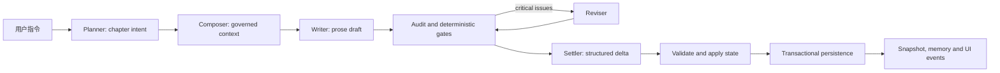

# InkOS 当前架构与开发优先级

状态：当前开发基线  
复核日期：2026-07-11

## 1. 复核结论

InkOS 已经不是原型式的单次文本生成器，而是一个本地优先的长篇小说生产系统。当前主干具备：

- 从创作简报、基础设定、卷级规划到章节生产的完整工作流。
- 结构化 truth、Markdown 可读投影、SQLite 时序记忆和章节快照。
- Planner、Composer、Writer、Auditor、Reviser、Settler 等多 agent 分工与多模型路由。
- Studio、TUI、CLI 和外部 `interact` 入口。
- 章节持久化事务、项目和书籍级并发控制、失败恢复及状态校验。
- 调用级 LLM telemetry、Studio SSE 诊断和 provider 兼容处理。

当前最主要的工程风险已经从持久化和跨入口一致性转移到真实模型质量证据、上下文成本、前端重依赖和模块边界。Playwright 使用独立临时根目录和动态端口；完整 Studio E2E 为 8/8，preparing/committed 两个真实子进程强杀/重启 recovery 场景合并连续运行 5 轮共 10/10。`pnpm stress:process` 进一步通过 8 worker、400 次竞争写入和 30 轮真实强杀/恢复；`pnpm release` 全绿。Studio、CLI、Chat 和 sub-agent 的已知 mutation 旁路、revise mode 漂移、恢复前置、配置跨进程写入和工作流崩溃恢复缺口均已关闭。

### 1.1 实际完成度与质量矩阵

状态定义：

- **已完成**：主路径已接线，有确定性回归，可作为当前功能基线。
- **可用/持续增强**：功能可运行，但真实场景证据、统一性或性能仍不足。
- **未完成**：只有局部实现、设计或路线图，没有可验收的完整用户路径。

| 能力域 | 开发状态 | 完成质量 | 实际证据与边界 |
| --- | --- | --- | --- |
| 建书、导入与基础设定 | 已完成 | 中高 | core、CLI、Studio 均有接线；stub authoring E2E 可完成建书，但真实 provider 建书没有稳定的发布级回归 |
| `plan -> compose -> write -> audit -> revise -> settle` | 已完成 | 高（确定性）/中（真实模型） | Runner、agent、gate 和状态测试完整；真实双路由完成 4 章，第 5 章在 20 分钟窗口内未完成 |
| 结构化 state、Canon、claim、volume、hook 治理 | 已完成/持续增强 | 高（结构）/中（语义） | schema、reducer、golden corpus 和门禁有回归；不能表述为完整语义证明 |
| 原子写入、章节/工作流事务、book/config lock | 已完成（本地基线） | 高 | 章节事务、workflow crash journal、跨进程书籍锁与项目配置锁均有回归；8 worker 竞争写入和 30 轮真实强杀/恢复通过 |
| rewrite、review、rollback | 已完成 | 高 | approve/reject/rewrite 共享 core mutation command；rewrite 由 PipelineRunner 持有唯一 book lock，CLI 不再手工组合回滚 |
| Studio、CLI、TUI、`interact` | 可用/持续增强 | 高（入口一致性）/中高（体验） | 高频 mutation、长操作和 sub-agent auditor 已共享 core command；revise mode 在 core/Studio/CLI 运行时校验，受控文件不能被 Chat 直接覆盖 |
| Studio telemetry 与错误诊断 | 可用/持续增强 | 中高 | SSE、Doctor、聊天和侧栏已有调用级信息与根因聚合；隔离 E2E 已纳入并通过发布命令，尚缺 service/model/agent 交叉报告及真实 provider 失败诊断覆盖 |
| 上下文与性能治理 | 可用/持续增强 | 中 | Composer 已有 token budget、protected source 和压缩规则；缺每个 source 的稳定指标、跨 agent 预算和缓存基线 |
| 本地 API 与依赖安全 | 已完成（localhost 基线） | 高 | localhost、无 wildcard CORS、密钥遮蔽、路径校验、生产审计为 0；不覆盖公网部署认证 |
| 局部章节重写、插件、平台格式导出 | 未完成 | 低/无完整验收 | 仍属于产品路线图，不应计入当前版本完成度 |

因此，当前项目可以描述为“本地长篇生产主链路稳定可用，平台可靠性基线已完成，真实模型质量和架构收敛仍在进行”，不能描述为“所有入口、性能和长篇语义质量已经完成”。

### 1.2 2026-07-11 验收快照

本快照描述本地 Windows 工作区的可复验工程质量，不将 stub E2E、确定性测试或单次真实模型试运行误表述为生产模型质量保证。

| 验证层级 | 命令/证据 | 当前结果 | 覆盖边界 |
| --- | --- | --- | --- |
| Core 回归 | `pnpm --filter @actalk/inkos-core test` | 121 个测试文件、1253 项通过 | 状态、mutation command、章节/工作流事务恢复、配置锁、Pipeline、provider、治理门禁与路径安全 |
| Studio 回归 | `pnpm --filter @actalk/inkos-studio test` | 33 个测试文件、392 项通过 | Hono API、共享 mutation 接线、受控文件保护、SSE 状态、失败处置、Doctor、路由与前端状态 |
| Studio E2E | `pnpm --filter @actalk/inkos-studio test:e2e` | 完整套件 8/8；两种真实进程 recovery 连续 5 轮共 10/10 | 隔离根目录、动态端口、事务恢复、进程强杀/重启、committed cleanup、陈旧锁回收、锁冲突、服务探测与 shell/API smoke |
| CLI 回归 | `pnpm --filter @actalk/inkos test` | 36 个测试文件、207 项通过 | 命令、TUI、运行时解析、发布打包与集成路径 |
| 进程压力 | `pnpm stress:process` | 通过 | 8 worker；book/config 各 200 次竞争 mutation；workflow 20 轮、chapter 10 轮 preparing/committed 强杀恢复 |
| 发布链 | `pnpm release` | 通过 | typecheck、semantic audit、build、bundle、1852 项 Vitest、publish manifest、生产审计与 8 项隔离 E2E 全绿 |

质量结论：确定性主链路、跨入口 mutation、章节/工作流崩溃恢复和跨进程竞争已形成全绿本地发布基线。当前仍不能由离线测试证明真实 LLM 的输出质量、上游可用性和成本；Studio 构建仍会报告部分 chunk 超过 500 KiB。

## 2. 系统边界

| 包 | 当前职责 | 边界要求 |
| --- | --- | --- |
| `packages/core` | agent、Pipeline、状态模型、持久化、记忆、LLM/provider、领域校验 | 所有书籍和章节业务规则应在此闭环 |
| `packages/cli` | CLI/TUI/daemon、参数解析、结构化输出 | 只组装命令和展示结果，不复制 Pipeline 规则 |
| `packages/studio` | React 工作台、Hono API、会话与诊断界面 | API 路由应调用 core 用例，不直接编排多步领域写入 |

当前包划分合理，不需要拆成微服务，也不需要为了扩展性把本地文件模型整体迁移到远程数据库。

## 3. 当前章节工作流

默认流程是 `plan -> compose -> write -> audit -> optional revise -> settle -> persist`。其中：

- 文笔模型负责正文渲染，不拥有设定和状态裁决权。
- Canon、claim、volume、hook 和 state validator 负责高风险约束。
- 结构化状态是权威真源，Markdown 是人类可读投影。
- 审计失败默认只自动修订有限次数，剩余问题交给人工审核。
- rewrite 必须由一个 core 用例在同一把 book lock 下完成回滚和再生成。

## 4. 数据、事务与并发模型

### 4.1 数据层级

| 层 | 作用 |
| --- | --- |
| `book.json`、`chapters/index.json` | 书籍配置和章节索引 |
| `story/state/*.json` | 权威结构化运行状态 |
| `story/*.md` | 可读 truth 投影和控制文档 |
| `story/runtime/*` | 每章 intent、context、rule stack、trace 和治理诊断 |
| `story/snapshots/*` | rewrite 和失败恢复使用的章节前状态 |
| `story/memory.db` | 相关事实、伏笔和摘要的时序检索 |

### 4.2 写入语义

- 章节索引、book config、结构化状态、secrets 与 Studio 项目设置通过临时文件加 rename 原子替换。
- 章节落盘使用 `.chapter-persistence.json` 事务标记记录 preparing/commit 状态。
- 事务开始前保留可恢复快照；失败时回滚，启动新写作前先恢复未完成事务。
- 同一本书的变更由 `.write.lock` 串行化。
- Studio、CLI 和配置迁移统一使用 `.inkos-project-config.lock`、原子替换和死进程陈旧锁回收，避免跨进程更新丢字段。
- transcript 追加使用内存中的序列和事件缓存，不再为每条消息重读完整 JSONL；缓存按 TTL 回收。

当前操作合同并不完全等价：

| 操作 | 锁所有权 | recovery / 事务边界 |
| --- | --- | --- |
| draft、write next、rewrite | `PipelineRunner` | 先恢复遗留章节事务；章节正文、索引和 truth 受 chapter persistence marker 保护 |
| plan、compose、audit、consolidate | core mutation command | 先恢复章节事务；再用 `.core-workflow-mutation.json` 和备份目录保护 runtime、audit 与 summary 多文件输出 |
| revise、repair-state、resync、import | `PipelineRunner` | 在同一把 book lock 内统一执行章节事务 recovery preflight |
| chapter save/patch、truth edit、book config/review mode、delete | core mutation command | 单一 book lock；delete 对不存在书籍统一返回 typed `BOOK_NOT_FOUND` |
| Studio/CLI/config migration | project config mutation | `.inkos-project-config.lock` 跨进程串行化、原子替换、死 PID 陈旧锁回收 |

### 4.3 当前限制

- book lock 会覆盖较长的 LLM 操作，保证正确性但限制同一本书的并行吞吐。
- 文件系统事务不是数据库事务；当前压力证据覆盖本地多进程竞争与强杀恢复，不覆盖网络文件系统、分布式租约或高并发服务端部署。
- 结构化 truth 与 Markdown 投影仍有双写成本，必须坚持“JSON 权威、Markdown 可重建”。
- workflow crash journal 采用备份、preparing/committed marker 与恢复清理；新增目标目录时必须同步扩展备份清单和故障注入。

## 5. API 与本地安全边界

- Studio 默认只监听 `127.0.0.1`；只有显式设置 `INKOS_STUDIO_HOST` 才扩大监听范围。
- API 不启用 wildcard CORS。
- Studio 只返回密钥是否已配置，不返回原始 API Key；空密钥更新默认保留现有值，显式 clear 才删除。
- core mutation command、agent session bookId、sessionId、revise mode 和主要章节路由均执行运行时校验；Studio Chat 对权威文件和运行时内部目录采用拒绝式 allowlist。
- destructive session 路由不能通过 traversal-shaped ID 访问 `.inkos` 或其他项目文件。
- 生产依赖通过 workspace overrides 固定到已修复版本；2026-07-11 的 `pnpm audit --prod` 为 0。

当前不需要为本地个人项目引入账号、RBAC 或远程鉴权。若默认部署目标改为局域网或公网，认证、CSRF、来源策略和速率限制必须先于远程开放完成。

## 6. 性能判断

### 6.1 主要成本

性能瓶颈按影响排序：

1. LLM 调用耗时、重试和上下文 token 体积。
2. 多 agent 串行链路和同书长时间持锁。
3. Studio 的 Mermaid、Shiki、WASM 和图形依赖体积。
4. CLI 集成测试反复启动子进程的时间。
5. 文件 JSON/Markdown 解析与原子写入。

文件系统目前不是首要性能瓶颈。除 transcript 这类高频追加路径外，不应优先做低收益微优化。

### 6.2 当前性能基线

- Studio 构建约转换 5200 个模块，入口 JS/CSS 仍在仓库 bundle 预算内。
- 页面路由已经使用 React lazy loading；Mermaid、代码高亮、数学和部分 Streamdown 插件仍在消息/摘要组件静态导入，部分 grammar 和 WASM chunk 超过 Vite 默认 500 KiB 警告线。
- 回归基线以实际执行命令为准；2026-07-11 的 core 回归为 121 个测试文件、1253 项通过，Studio 回归为 33 个测试文件、392 项通过，CLI 为 36 个测试文件、207 项通过，另有 8 个隔离 E2E 场景。CLI 集成测试反复启动子进程，仍是主要耗时来源。
- `scripts/live-dual-api-routing.mjs` 已输出机器可读报告、章节健康检查和按 agent+phase 的耗时汇总；尚缺 service/model 交叉维度、稳定阈值和发布门禁。
- Composer 已执行 token budget、protected source 和可压缩上下文策略；尚缺 per-source 指标、跨 agent 预算与稳定缓存基线。

## 7. 设计问题与技术债

### 7.1 多入口业务编排

Studio、CLI、Chat 和直接 API 历史上存在各自组合 rollback、write、approve、truth edit 的路径。当前已知写操作均已收敛到 core command 或 project config mutation：sub-agent auditor 使用 `audit-chapter`，Studio Chat 拒绝直接覆盖权威文件，revise mode 在运行时解析。后续新增 mutation 时应把“校验、锁、恢复、事务、事件、错误合同”作为一个完整用例提交，入口层只负责参数与展示。

### 7.2 大型模块

- `packages/studio/src/api/server.ts` 约 4802 行，同时承担路由、配置、密钥、会话、provider 探测和业务调度。
- `packages/core/src/pipeline/runner.ts` 约 3731 行，同时承担多个工作流、恢复、持久化和事件编排。

拆分时应按业务域拆分，不按“utils/helpers”堆放：books、chapters、sessions、services、project settings，以及 foundation、chapter、rewrite、persistence workflow。

### 7.3 依赖接口过宽

测试 mock 经常需要模拟完整 `StateManager`。后续应引入更小的能力接口，例如 `BookLock`、`BookRepository`、`ChapterRepository`、`RuntimeStateStore`，但只在实际拆分工作流时引入，避免先造抽象后找用途。

### 7.4 上游依赖生命周期

`@mariozechner/pi-ai` 与 `@mariozechner/pi-agent-core` 已被上游标记 deprecated。短期继续固定版本，所有 provider-specific 类型必须限制在 LLM adapter 层，并为后续替换保留合同测试。

## 8. 当前开发优先级

优先级定义：P0 是下一个稳定版本必须完成；P1 是随后一个工程迭代；P2 是产品扩展，不应抢占可靠性工作。

### P0：可靠性与跨入口一致性（已完成）

#### P0.1 已完成：稳定隔离 E2E 的恢复合同

隔离基础设施已完成：`pnpm --filter @actalk/inkos-studio test:e2e` 为每次运行分配独立临时项目根目录、临时 stub secrets 和动态 API/前端端口；teardown 仅终止本次进程并清理本次目录。该命令已纳入根目录 `pnpm release`。

修复结果：recovery 用例等待章节 1 出现非空 `operationId`，不再把预置的 `interrupted` 章节误认为后台恢复后的新章节。完整套件现为 8/8；preparing/committed 两个真实子进程强杀/重启用例合并连续运行 5 轮共 10/10；根目录 `pnpm release` 全绿。

已完成范围：

- 每次 E2E 创建独立临时项目根目录，并通过环境变量传给 seed、Studio server 和 fixture。
- teardown 只清理本次运行创建的目录和进程；运行元数据和日志不再共享工作区文件。
- authoring E2E 覆盖建书、写一章、truth diagnostics，以及中断章节事务的自动回滚、恢复提示与持久化 recovery diagnostic；真实进程 fixture 会持锁写入部分章节/索引/truth，随后被系统强杀，由新进程回收陈旧 `.write.lock` 并回滚；还覆盖自定义服务的成功探测与保存、未知服务商错误、“未保存配置不落盘”，以及锁冲突时 `409 BOOK_LOCKED` 且章节不变的合同；另有 Studio shell/API smoke。

完成定义已满足。多进程竞争压力基准也已由 `pnpm stress:process` 落地；后续工作转向真实 provider 的建书与超时/降级诊断。

#### P0.2 第四阶段已完成：收敛 core mutation command

本阶段目标：先收敛 Studio、CLI 的高频直接 mutation 与长操作，建立可复用的 core command 边界。

已完成范围：

- 新增 approve/reject/rewrite 统一命令合同和 typed chapter-not-found error。
- approve/reject 在 core 内持有 book lock；rewrite 委托 `PipelineRunner.rewriteChapter()`，避免双重锁。
- Studio approve/reject/rewrite 与 CLI review/rewrite 已接入；CLI rewrite 的手工文件、索引和快照编排已删除。
- `--keep-subsequent` 的旧 CLI 行为得到保留和回归覆盖。
- chapter save/patch 复用统一 edit transaction 和 manual review issue，Studio API、Studio Chat 与 interaction tools 均通过 core command 写入。
- foundation revise 由 command 持有唯一 book lock，Studio 与 architect sub-agent 不再直接调用 pipeline 编排。
- canonical truth edit 共享 allowlist、路径校验、原子写入和只读 runtime/legacy shim 错误合同。
- approve-all 在单次锁与索引写入内批量批准待审章节，CLI 不再直接改索引。
- entity rename 通过 command 复用 edit transaction，interaction 不再自行持锁编排。
- Studio/CLI book update 共享 schema 校验、时间戳、锁和原子配置写入，并返回修改前后合同。
- chapter review mode 共享 schema 校验、锁、原子配置写入与 inherit 语义；book delete 在 command-owned lock 内删除书籍，并在 core 层拒绝不安全 book ID。
- Studio/CLI plan、compose、audit、consolidate 由 command 持有唯一 book lock；执行领域回调前统一处理 preparing rollback 或 committed marker cleanup，并只在发生恢复时附加 `recovery`，原有返回字段保持兼容。
- Studio 已删除对应的外层锁包装；CLI 已删除这些命令的直接 Pipeline/Consolidator 调用和 book delete 文件删除编排。

阶段完成定义已满足：已知 mutation 只有一个领域实现，入口层只负责参数、事件与展示；sub-agent auditor、revise runtime mode 和受控文件 Chat edit 也已在 P0.4 关闭。

#### P0.3 已完成：扩展恢复、checkpoint 与进程压力

第一阶段已完成：章节持久化恢复不再静默执行。`StateManager` 会返回“无操作、清理已提交 marker、回滚未完成章节”的结构化结果，并记录只读的 `story/runtime/recovery.json`；`write next`、`draft` 与 `rewrite` 的 core 结果和 Studio SSE 完成事件会透传该结果，Studio 书籍页会在实际回滚时显示恢复提示，Truth Files 可在后续重载中打开恢复诊断。CLI 的 `write next --json` 和 `write rewrite --json` 保持原有顶层形状，但为每项结果附加稳定的 `checkpoint`（operation ID、章节、状态、恢复结果），常规输出在发生恢复时提供简要说明。每次章节操作生成 `operationId`，并将其写入 LLM telemetry、持久化 marker、恢复诊断、章节索引和完成事件；Studio 书籍章节列表中的操作 ID 可直接打开 `#/doctor?operationId=...`，只显示该次操作关联的 Doctor 调用。书籍页还会标明 write、draft、rewrite、revise 或 audit 的失败阶段，将可识别的凭据问题、状态降级和暂时性写作失败分别导向模型配置、状态修复与安全重试，并始终保留进入 Doctor 的入口。隔离 E2E 已注入 `preparing` 事务，并验证回滚、继续写章、恢复诊断与操作追踪跳转。

本轮故障注入已覆盖：部分章节/索引/truth 写入可回滚；新 `StateManager` 实例可接管 `preparing` 事务；真实 writer 子进程在 preparing 状态被强杀后，新进程可回收陈旧锁、保留 operation ID、回滚到 snapshot 0 并记录 `recovery.json`；在 committed 状态被强杀后，新进程只清理 marker，章节、索引和 truth 均保持已提交状态。`pnpm stress:process` 还覆盖 8 worker 并发、book/config 各 200 次 mutation，以及 workflow 20 轮、chapter 10 轮 preparing/committed 强杀恢复，marker、backup 和陈旧锁均完成清理。

#### P0.4 已完成：关闭实际旁路与运行时合同漂移

1. sub-agent auditor 已接入 `audit-chapter` core command。
2. `ReviseModeSchema` 在 core 边界解析；legacy `local-fix` 映射为 `spot-fix`，Studio/CLI 对未知 mode 返回校验错误。
3. revise、repair-state、resync 和 import 已在锁内统一执行 recovery preflight。
4. Studio 显式 Chat edit 已拒绝 `book.json`、章节索引、事务/锁文件和 story 内部权威目录。
5. delete-book 对不存在书籍统一为 typed `BOOK_NOT_FOUND`，Studio 映射为 404。
6. CLI、Studio 与配置迁移已统一使用跨进程项目配置 mutation。
7. plan/compose/audit/consolidate 已增加 workflow crash journal，callback 失败和进程重启均可回滚或清理 committed marker。
8. 根级 `pnpm release` 已包含 typecheck、semantic audit、build、bundle、tests、publish manifest、生产依赖审计和 Studio E2E。

### P1：质量、性能与模块治理

#### P1.1 真实多章报告与质量门禁

- 在现有 report v1 和 agent+phase 汇总上增加 service/model 维度。
- 汇总超时、重试、格式 fallback、长度偏差和 token 成本，并定义可配置阈值。
- 建立 3-5 章基准 corpus，避免只验证单章成功。

#### P1.2 上下文和 token 性能

- 在现有 Composer token budget 和 protected source 规则上，记录每个 context source 的字符数、token 数和是否被压缩。
- 缓存稳定 foundation、角色和卷级摘要的编译结果。
- 将预算和退化策略从 Composer/provider guard 扩展到 Planner、Writer 和 Auditor。

#### P1.3 拆分大型模块

- 将 Studio server 按 books、chapters、sessions、services、settings 路由拆分。
- 将 PipelineRunner 按 foundation、chapter、rewrite 和 persistence workflow 拆分。
- 在拆分过程中引入小能力接口，减少宽 mock。

#### P1.4 Studio 重依赖延迟加载

- 保留已完成的页面级 lazy loading；进一步让 Mermaid 仅在渲染图表消息时加载。
- Shiki 仅加载实际语言 grammar 和当前主题。
- 保持现有入口 bundle 预算，并增加关键页面加载时间基线。

#### P1.5 测试分层提速

- 提交级运行 core、Studio API 和 CLI smoke。
- 合并级运行完整 Vitest。
- 发布级运行 build、bundle、audit、publish manifest 和隔离 E2E。
- 根级 `pnpm release` 已覆盖 workspace typecheck、semantic audit、build、Studio bundle、Vitest、publish manifest、生产依赖审计和 Studio E2E；下一步是把快速 smoke 与完整门禁在 CI 中分层，降低日常反馈时间。

### P2：产品扩展

- 局部章节重写和受控级联更新。
- 自定义 agent/plugin 合同。
- 起点、番茄等平台格式导出。
- 更完整的治理仪表板和诊断跳转。

## 9. 当前不优先做

- 不迁移到微服务。
- 不把全部状态迁移到远程数据库。
- 不为默认 localhost 场景建设完整账号和 RBAC。
- 不在 command 和恢复模型收敛前扩展插件系统。
- 不用增加重试次数掩盖真实 provider 格式不稳定。

## 10. 当前验证基线

2026-07-11 本轮实现后的全量复核结果：

- `pnpm typecheck`：通过。
- `pnpm test`：1852 个测试通过（core 1253、Studio 392、CLI 207）。
- `pnpm build`：通过。
- `pnpm check:studio-bundle`：通过。
- `pnpm verify:publish-manifests`：通过。
- `pnpm audit:semantic-patterns`：0 个候选。
- `pnpm audit --prod`：0 vulnerabilities。
- `pnpm --filter @actalk/inkos-studio test:e2e`：完整套件 8/8；preparing/committed 真实进程 recovery 连续 5 轮共 10/10。
- `pnpm stress:process`：通过；8 worker，book/config 各 200 次竞争 mutation，workflow 20 轮与 chapter 10 轮强杀恢复。
- `pnpm release`：通过，发布链全绿。

Playwright E2E 与进程压力测试已具备安全隔离、preparing/committed 真实进程死亡、竞争写入和重复稳定性证据。下一优先级是建立真实多章质量/性能报告，并降低 Studio 重依赖与全量门禁耗时。

## 11. 项目审阅意见

### 11.1 产品方向

项目已经拥有足够多的产品入口和治理能力。下一版本不应继续横向增加插件、平台导出或新的 agent 类型，而应把“本地写作一次成功、失败可解释、重启可恢复”做成稳定体验。对个人项目而言，这比增加更多功能更能提升实际可用性。

### 11.2 架构方向

不要先做纯粹的大文件拆分。两轮 mutation 迁移已经证明，更有效的顺序是按垂直动作把校验、锁、事务、事件和返回合同收敛成 core command，再沿同一模式迁移其他 mutation。这样模块拆分会由真实边界驱动，而不是把大文件机械切成多个相互调用的文件。

### 11.3 质量方向

1852 个确定性测试、全绿发布链和真实多进程压力基准是明显优势，但测试数量仍不能替代真实模型质量证据。事务、锁和进程恢复的本地可靠性 P0 可以关闭；下一阶段应把精力转向 3-5 章真实模型报告、失败样例归档和测试分层耗时。

### 11.4 性能方向

优先优化 LLM 阶段耗时、上下文 token 和消息渲染重依赖，不要优先改造普通 JSON 文件读写。Studio 已有页面级 lazy loading，下一步应针对 Mermaid、Shiki、WASM 和 Streamdown 插件做真正的使用时加载，并用页面加载基线验证收益。

### 11.5 建议的执行顺序

1. 在现有 live report 上增加 service/model、token 成本、重试和 fallback 统计，形成 3-5 章真实质量基线。
2. 为 Composer/Planner/Writer/Auditor 建立 per-source 与跨 agent token 预算，优先减少真实 LLM 耗时和成本波动。
3. 为 Mermaid、Shiki、WASM 重依赖建立使用时加载和关键页面基线。
4. 按 books/chapters/sessions/services 和 foundation/chapter/persistence 业务域拆分 `server.ts` 与 `runner.ts`，同步缩小测试 mock 接口。
5. 在 CI 中区分快速 smoke、完整 Vitest、进程压力和联网 release，保持可靠性证据同时缩短日常反馈。

### 11.6 2026-07-11 全项目自洽审查关闭记录

| 原严重度 | 发现 | 当前状态 |
| --- | --- | --- |
| P1 | sub-agent auditor 绕过 command-owned lock/recovery | 已关闭：统一调用 `audit-chapter` core command |
| P1 | revise mode 只有 TypeScript cast，legacy 使用非法 `local-fix` | 已关闭：core runtime schema + Studio/CLI 校验 + `spot-fix` 映射 |
| P1 | revise、repair-state、resync、import 缺 recovery preflight | 已关闭：在 book lock 内统一恢复 |
| P1 | Studio Chat 可直接覆盖权威 JSON/YAML | 已关闭：受控文件和内部目录拒绝式保护 |
| P2 | delete-book not-found 合同不一致 | 已关闭：typed `BOOK_NOT_FOUND`，Studio 404 |
| P2 | CLI config 与 migration 直接覆盖 `inkos.json` | 已关闭：跨进程项目配置锁和原子替换 |
| P2 | 根级 release 门禁不完整 | 已关闭：typecheck、semantic、manifest、prod audit 全部纳入 |
| P2 | plan/compose/audit/consolidate 缺自身崩溃事务 | 已关闭：workflow journal、备份、rollback/committed cleanup 与真实强杀压力覆盖 |

本轮没有发现会推翻当前主链路设计的结构性矛盾。JSON 权威状态、Markdown 投影、章节快照、claim/hook/volume 门禁、多模型路由和本地优先架构之间总体一致。剩余风险主要是长期可维护性、真实模型语义质量、上游 provider 波动和前端资源成本，而不是已知的数据一致性旁路。
